# 🐾🐕 Pawtel - 🏨 - Comparador de Hoteles para Mascotas 🐱🐾
**🎯Nuestra misión** es ofrecer una experiencia fácil e intuitva que permita encontrar el hospedaje perfecto para su mejor amigo.

🌍 **Visítanos en nuestra Página web y Redes sociales proximamente.**

📌 **Página Web:** [www.pawtel.es](https://www.pawtel.es)
📩 **Contáctanos:** [📧 hello@pawtel.es](mailto:chello@pawtel.es)

---

  

# 📑 **Reporte de Tiempo - PPL** 🚀

**📅 Entregable:** PPL
**📆 Fecha:** 29/04/2025
**👥 Equipo:** G11

|  |   |
|--------------------------|---|
| `Luis Mellado Díaz (PM🏆)` | `Daniel Flores De Francisco (PM🏆)` |
| Fernando Castelló Sánchez | Francisco Miguel Jiménez Morales |
| Javier García Sebastián | Javier Ruiz Garrido |
| Jorge Gómez de Tovar | Andrés Martínez Reviriego |
| Manuel Castillejo Vela | Rafael Castillo Cebolla |
| Claudio Cortés Carrasco | Sergio Trenado González |
| Yesica Garate Fuentes | David González Martínez |

---
## Historial de Versiones
| Fecha       | N° de Versión | Descripción               | Elaborado por           |
|-------------|---------------|---------------------------|-------------------------|
| 29/04/2025  | v 1.0         | Versión inicial del documento - Parte de Dani | Daniel Flores de Francisco |
| 29/04/2025  | v 1.1         | Parte de Andrés | Andrés Martínez Reviriego |
| 29/04/2025  | v 1.2         | Parte de Fernando | Fernando Castelló Sánchez |
| 29/04/2025  | v 1.3         | Parte de Francisco | Francisco Miguel Jiménez Morales |
| 29/04/2025  | v 1.4         | Parte de Luis | Luis Mellado Díaz |

---

## Gráfica que muestra el tiempo empleado por el grupo al completo

## Reporte de tiempo de Javier García Sebastián

**Periodo:** 27/03/2025 - 09/04/2025
**Total de tiempo trabajado:** 11:34:06

### Proyecto Pawtel - Distribución del tiempo

| Descripción | Duración |
|-------------|----------|
| informe de feedback de usuarios piloto | 00:44:33 |
| preparar presentación 28/03/2025 | 02:47:47 |
| clase 28/03/2025 | 04:00:00 |
| discusión sobre marketing via discord + creación de RRSS | 00:52:18 |
| GUIÓN: dividir trabajo de presentación para el 04 | 00:38:00 |
| GUIÓN: dividir trabajo de presentacion para el 11 | 00:48:19 |
| PRESENTACIÓN: diapositivas presentación 11/04/2025 | 00:51:11 |
| MARKETING: contenido redes sociales | 01:03:00 |

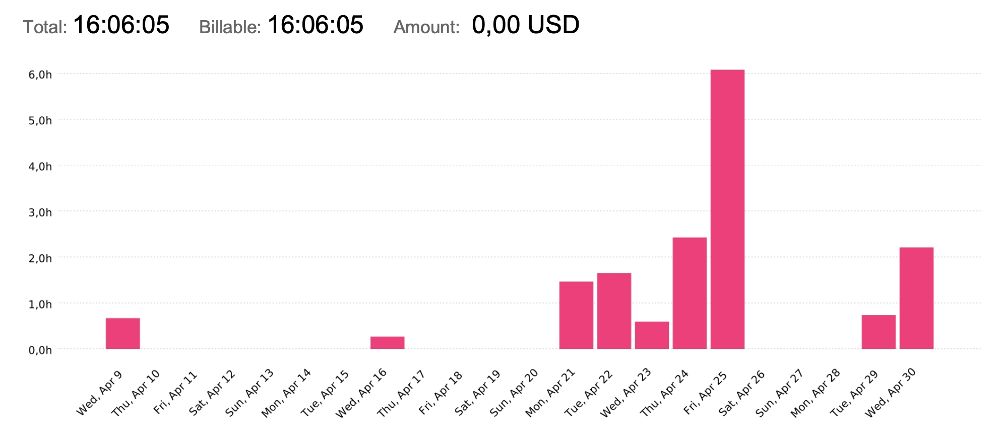

---

## Reporte de tiempo de Yesica Leydi Garate Fuentes

**Periodo:** 27/03/2025 - 09/04/2025
**Total de tiempo trabajado:** 32:11:00

### Proyecto Pawtel - Distribución del tiempo

| Descripción | Duración |
|-------------|---------|
| Mejoras del Storyboard de Inversores | 01:22:00|
| Desarrollo de Presentación: Planificacíon de Marketing II (SPRINT 03) | 01:55:00|
| Desarrollo de Presentación: Planificacíon de Marketing - Roles de Equipo (SPRINT 03)  | 00:50:00 |
| Modificaciones finales y Añadido Pantalla dirigido a Dueños de Alojamientos | 02:48:00|
| Modificación segun feedback de pantallas Home, Sobre Nosotros y Contact II | 06:12:00 |
| Modificación segun feedback de pantallas Home, Sobre Nosotros y Contact I | 03:50:00|
| Desarrollo de Presentación: Modificaciones a video de Anuncio, Planificación de Marketing | 01:57:00 |
| Clase 28 marzo                                                                                                   | 04:00:00  |
| Mejoras del Video de Anuncio dirigido a Dueños de Mascotas | 02:10:00|
| Desarrollo de Presentación: Planificación de Marketing | 01:25:00 |
| Desarrollo de Presentación: Rendimiento, Planificación de Marketing | 01:22:00|
| Planificación y Marketing: Investigación y desarrollo de Video de anuncio dirigido a Dueños de Mascotas | 04:20:00 |

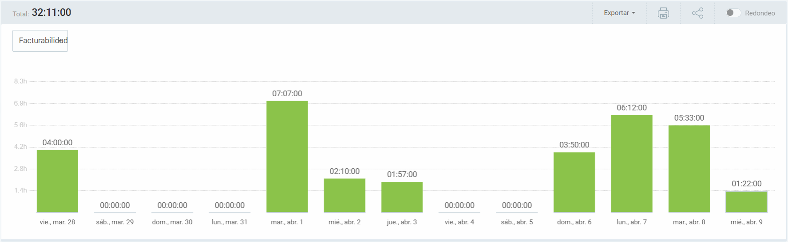
---

## Reporte de tiempo de Sergio Trenado Gonzalez

**Periodo:** 27/03/2025 - 09/04/2025
**Total de tiempo trabajado:** 33:46:59

### Proyecto Pawtel - Distribución del tiempo

| Descripción                                                                                                      | Duración  |
|------------------------------------------------------------------------------------------------------------------|-----------|
| Clase 28 marzo                                                                                                   | 04:00:00  |
| Clase 4 abril                                                                                                    | 04:00:00  |
| Mejorar estilo de imágenes + Feature: Mejorar pantalla de "Detalles de hotel"                                     | 03:57:04  |
| PRs + Informe de horas + Feature: Pulir detalles de las pantallas                                                | 03:41:39  |
| Mejorando PR (CRUD Hoteles) + Feature: Mejorar pantalla de "Mis reservas" + Feature: Mejorar pantalla de "Detalles de hotel" | 03:01:00  |
| Mejorando PR (CRUD Hoteles)                                                                                      | 02:46:10  |
| Revisando + Mejorando PR (CRUD Hoteles)                                                                          | 02:01:01  |
| Terminos y condiciones + Fixeos + Iconos PWA                                                                     | 02:00:11  |
| Puliendo ultimos detalles y mejorando pantalla de admin                                                          | 01:46:41  |
| Arreglando diversas cosas del proyecto                                                                           | 01:44:14  |
| Mejorando el estilo y añadiendo paginaciones                                                                      | 01:39:42  |
| Reunión Inicio Sprint 3                                                                                          | 00:51:39  |
| Frontend Organización Sprint 3                                                                                   | 00:51:28  |
| Feature: Mejorar pantalla de "Mis reservas" + Feature: Mejorar pantalla de "Detalles de hotel"                     | 00:48:08  |
| Revisando PRs                                                                                                    | 00:38:02  |

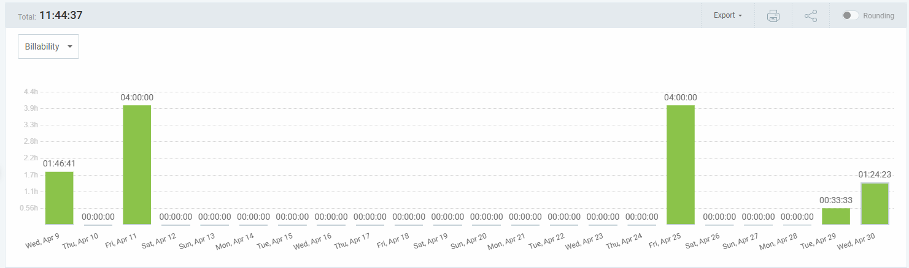
---

## Reporte de tiempo de Rafael Castillo Cebolla

**Periodo:** 14/03/2025 - 26/03/2025
**Total de tiempo trabajado:** 38:42:00

### Proyecto Pawtel - Distribución del tiempo

| Descripción | Duración |
|-------------|---------|
| QA | 08:55:00 |
| Preparar entrega  | 01:03:00 |
| Revisar frontend | 03:00:00  |
| Booking Hold  | 03:42:00 |
| Clases | 4:00:00 |
| Tareas alta prioridad sprint 3 | 02:49:00 |
| Reunión | 01:00:00 |
| Hotfix | 02:46:00 |

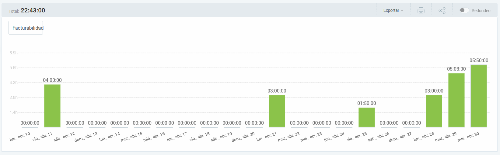
---

## Reporte de tiempo de Manuel Castillejo Vela

**Periodo:** 27/03/2025 - 09/04/2025

**Total de tiempo trabajado:** 19:15:05

### Proyecto Pawtel - Distribución del tiempo
| Description                                           | Time (h) |
|-------------------------------------------------------|----------|
| KBReport                                              | 00:51:49 |
| Reunion semanal                                       | 00:41:14 |
| Clase                                                 | 04:00:00 |
| #271 Feature: Cover imagenes                          | 02:16:02 |
| SLA agreement y pricing                               | 01:08:13 |
| Informe de IA                                         | 00:25:58 |
| #276 Actualización cambios en tiempo real edit hotel | 00:35:00 |
| Adicion de feedback a la base de datos comun         | 00:47:30 |
| #237 Feature: Funcionamiento imagenes Frontend       | 08:29:19 |
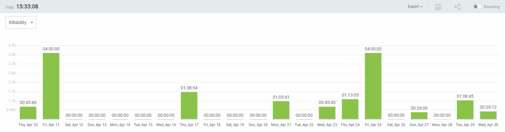
---

## Reporte de tiempo de Luis Mellado Diaz

**Periodo:** 09/04/2025 - 29/04/2025

**Total de tiempo trabajado:** 18:23:00

### Proyecto Pawtel - Distribución del tiempo

| Descripción                         | Duración  |
|-------------------------------------|-----------|
| QA presentación                     | 01:00:00  |
| Clase 11/4                          | 04:00:00  |
| Guión WPL                           | 02:03:23  |
| PawPoints                           | 02:00:00  |
| Revision WPL                        | 00:26:44  |
| Reunión y Organización PPL          | 00:51:45  |
| Equipo WPL                          | 01:25:36  |
| QA-WPL                              | 00:35:45  |
| Time Report                         | 00:27:00  |
| Supervisión WPL                     | 00:46:54  |
| IA report                           | 00:35:00  |
| Clase 25/4                          | 03:00:00  |
| Actualizar Landing                  | 01:11:04  |

---

## Reporte de tiempo de Jorge Gomez de Tovar

**Periodo:** 27/03/2025 - 09/04/2025
**Total de tiempo trabajado:** 20:20:00

| Descripción                           | Duración  |
|--------------------------------------|-----------|
| Clase                                | 08:00:00  |
| Informes de tiempo e IA              | 00:30:00  |
| Autenticar hotel owner aprobado      | 02:00:00  |
| Añadir imágenes reales al seeder     | 02:10:00  |
| Revisión PR mejorar autorización     | 00:40:00  |
| Investigar coverage                  | 01:00:00  |
| Añadir admin a backend               | 06:00:00  |

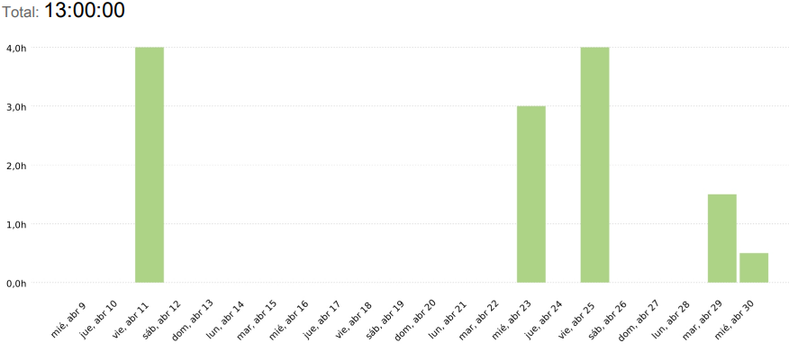
---

## Reporte de tiempo de Javier Ruiz Garrido

**Periodo:** 27/03/2025 - 09/04/2025
**Total de tiempo trabajado:** 18:42:52

### Proyecto Pawtel - Distribución del tiempo

| Descripción | Duración |
|-------------|---------|
| clase | 08:00:00 |
| Trabajos automatizados backend | 04:46:148 |
| Presentacion | 02:52:27 |
| Borrar booking hold activo al crear booking | 01:23:58 |
| Pequeños arreglos backend | 01:03:45 |
| Informes | 00:19:49 |
| Revision pr | 00:16:39 |

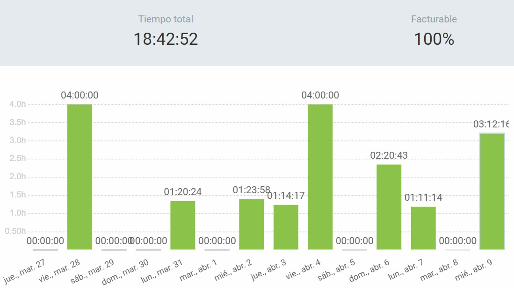
---

## Reporte de tiempo de Francisco Miguel Jiménez Morales

**Periodo:** 11/04/2025 - 02/05/2025
**Total de tiempo trabajado:** 19:17:31

### Proyecto Pawtel - Distribución del tiempo

| Descripción                                  | Duración   |
|----------------------------------------------|------------|
| Clase                                        | 04:00:00   |
| Gestión de usuarios pilotos                  | 01:49:41   |
| Preparar presentación                        | 00:21:27   |
| Gestión de usuarios pilotos                  | 00:06:12   |
| Preparar presentación                        | 00:37:40   |
| Preparar presentación                        | 00:38:34   |
| Preparar Killer Opener                       | 00:29:45   |
| Preparar presentación                        | 00:44:59   |
| Preparar presentación                        | 00:24:38   |
| Preparar presentación                        | 00:16:05   |
| Clase                                        | 04:00:00   |
| Aplicar feedback a la presentación           | 00:55:53   |
| Misc (Revisión de feedback + redacción de docs) | 00:16:47   |
| Misc (Revisión de feedback + redacción de docs) | 00:35:50   |
| Clase                                        | 04:00:00   |

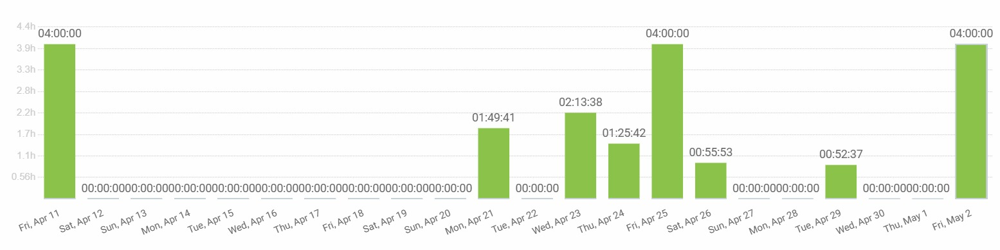
---

## Reporte de tiempo de Fernando Castelló Sanchez

**Periodo:** 10/04/2025 - 29/04/2025
**Total de tiempo trabajado:** 13:42:59

### Proyecto Pawtel - Distribución del tiempo

| Descripción | Duración |
|-------------|---------|
| Clase | 04:00:00 |
| Feedback | 00:24:23 |
| Presentación | 00:19:44 |
| Presentación | 02:16:53 |
| Presentación | 00:58:44 |
| Presentación | 00:32:17 |
| Presentación | 00:05:19 |
| Clase | 04:00:00 |
| Feedback | 00:28:31 |
| Presentación | 00:28:07 |
| Informe IA | 00:08:41 |

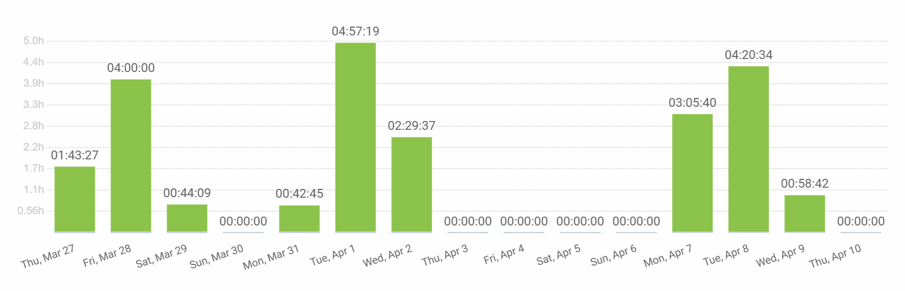
---

## Reporte de tiempo de David Gonzalez Martinez

**Periodo:** 27/03/2025 - 10/04/2025
**Total de tiempo trabajado:** 19:40:23

### Proyecto Pawtel - Distribución del tiempo

| Descripción | Duración |
|-------------|---------|
| Tarea filtros globales | 01:38:22 |
| Miscelaneo/Review/Ayuda | 00:57:55 |
| Fix lots of bugs | 02:49:00 |
| Clase | 04:00:00 |
| Organización/Misc | 00:29:19 |
| Ver PR de Playwright, ver PR de validación | 00:14:19 |
| Tarea filtros globales / misc / review | 00:18:53 |
| Tarea filtros globales / misc | 01:26:11 |
| Misc | 02:32:07 |
| Gestionar contraseñas | 00:17:10 |
| Despliegue y retoques varios | 00:07:34 |
| Despliegue y retoques | 02:59:09 |
| Review | 00:26:24 |
| Reunión | 00:50:00 |
| Rendimiento y misc | 00:34:00 |

---

## Reporte de tiempo de Daniel Flores de Francisco

**Periodo:** 11/04/2025 - 2/05/2025
**Total de tiempo trabajado:** 19:23:22

### Proyecto Pawtel - Distribución del tiempo

| Tarea                                      | Tiempo   |
|--------------------------------------------|----------|
| Reunion Marketing                          | 01:00:00 |
| Preparando PPL                             | 00:36:00 |
| Prsentacion PPL Semana 1.                  | 00:52:00 |
| Organización PPL y presentaciones          | 01:09:00 |
| ISPP                                       | 04:00:00 |
| Indexación de web por keyword              | 01:46:00 |
| Presentacion y delyvery PPL                | 02:00:00 |
| Clase ISPP                                 | 08:00:00 |
| Arreglar Test 1                            | 03:10:00 |
| SemRush Segmentacion Mercado               | 01:50:00 |
| Googlw Trends, Slides y QA                 | 04:00:00 |

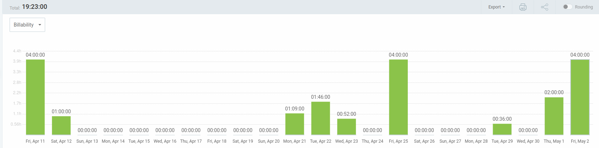
---

## Reporte de tiempo de Claudio Cortes Carrasco

**Periodo:** 14/03/2025 - 25/03/2025
**Total de tiempo trabajado:** 28:45:50

### Proyecto Pawtel - Distribución del tiempo

| Descripción | Duración |
|-------------|---------|
| Clases | 08:00:00 |
| Presentación Diapositivas | 01:22:00 |
| Video anuncio y diapositivas y guión | 01:25:00 |
| Presentación | 02:05:00 |
| Hacer documento feedback ispp | 00:16:00 |
| Añadir ruta de listado de hotel owner no validados y otra ruta para borrar hotel owner no validados | 02:09:06 |
| cambiar metodo de borrar hotel owner no validados por consistencia| 01:09:00 |
| graficas rendimiento y correciones varias | 01:45:09 |
| planificación marketing | 01:26:42 |
| presentación diapositivas y cambio storyboards| 01:22:23 |
|

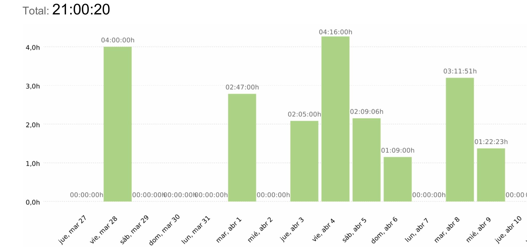
---

## Reporte de tiempo de Andrés Martínez Reviriego

**Periodo:** 10/04/2025 - 29/04/2025
**Total de tiempo trabajado:** 14:47:53

### Proyecto Pawtel - Distribución del tiempo

| Descripción | Duración |
|-------------|---------|
| Asistencia a clase | 08:00:00 |
| Presentación | 06:47:53 |

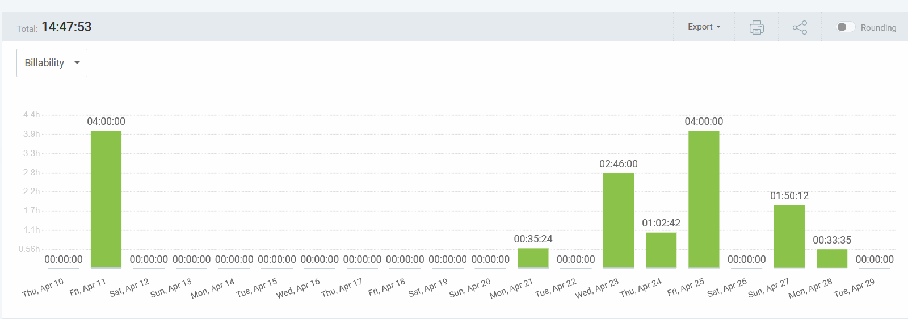
