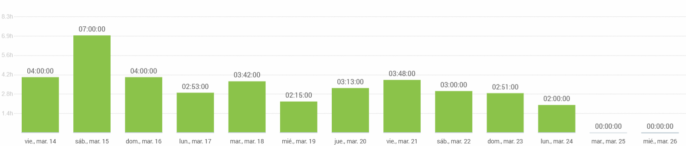
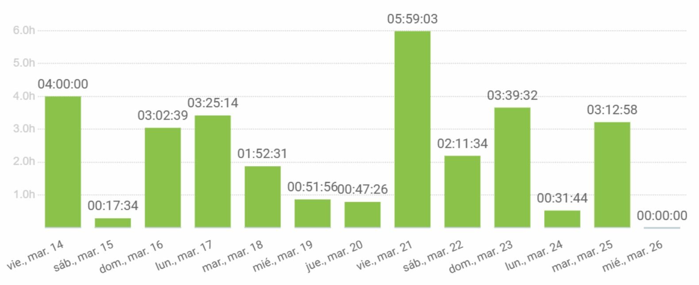
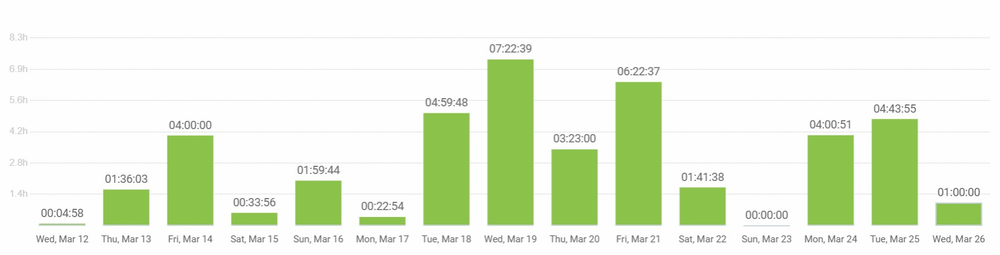
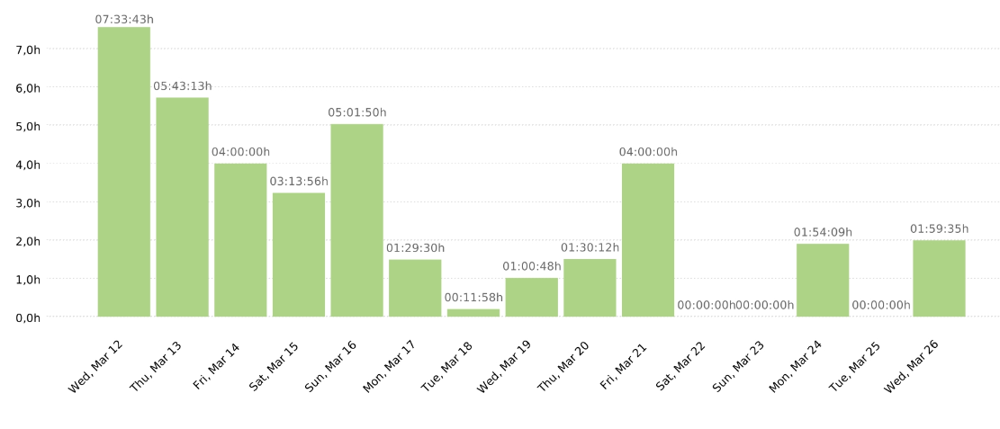

# 🐾🐕 Pawtel - 🏨 - Comparador de Hoteles para Mascotas 🐱🐾
**🎯Nuestra misión** es ofrecer una experiencia fácil e intuitva que permita encontrar el hospedaje perfecto para su mejor amigo.

  

🌍 **Visítanos en nuestra Página web y Redes sociales proximamente.**

📌 **Página Web:** [www.pawtel.es](https://www.pawtel.es)
📩 **Contáctanos:** [📧 hello@pawtel.es](mailto:chello@pawtel.es)

---

  

# 📑 **Reporte de Tiempo - Sprint 2** 🚀

**📅 Entregable:** Sprint 2
**📆 Fecha:** 26/03/2025
**👥 Equipo:** G11

|  |   |
|--------------------------|---|
| `Luis Mellado Díaz (PM🏆)` | `Daniel Flores De Francisco (PM🏆)` |
| Fernando Castelló Sánchez | Francisco Miguel Jiménez Morales |
| Javier García Sebastián | Javier Ruiz Garrido |
| Jorge Gómez de Tovar | Andrés Martínez Reviriego |
| Manuel Castillejo Vela | Rafael Castillo Cebolla |
| Claudio Cortés Carrasco | Sergio Trenado González |
| Yesica Garate Fuentes | David González Martínez |

---
## Historial de Versiones
| Fecha       | N° de Versión | Descripción               | Elaborado por           |
|-------------|---------------|---------------------------|-------------------------|
| 24/03/2025  | v 1.0         | Versión inicial del documento - Parte de Dani | Daniel Flores de Francisco |
| 25/03/2025  | v 1.0         | Parte de Luis | Luis Mellado Díaz |
| 26/03/2025  | v 1.2         | Parte de Fernando | Fernando Castelló Sánchez |
| 26/03/2025  | v 1.3         | Parte de Javi G | Javier García Sebastián |
| 26/03/2025  | v 1.4         | Parte de David | David González Martínez |
| 26/03/2025  | v 1.5         | Parte de Francisco | Francisco Miguel Jiménez Morales |

---

## Gráfica que muestra el tiempo empleado por el grupo al completo

## Reporte de tiempo de Javier García Sebastián

**Periodo:** 12/03/2025 - 26/03/2025
**Total de tiempo trabajado:** 28:20:57

### Proyecto Pawtel - Distribución del tiempo

| Descripción | Duración |
|-------------|----------|
| GUIÓN: dividir trabajo de presentación para el 21 | 00:28:29 |
| clase 14/03/2025 | 04:00:00 |
| FRONTEND: perfil de usuario (versión 3.0) | 02:13:45 |
| FRONTEND: perfil de usuario (versión 2.0) | 02:34:43 |
| FRONTEND: corregir errores perfil de usuario | 00:20:42 |
| clase 21/03/2025 | 04:00:00 |
| preparar presentación 21/03/2025 | 04:57:21 |
| DOCUMENTACIÓN: organizar reporte del tiempo del equipo | 00:51:11 |
| PRESENTACION: diapositivas presentacion dia 14/3/2025 | 01:50:38 |
| conectar pantalla de UserProfile con backend | 01:45:58 |
| GUIÓN: dividir trabajo de presentación para el 28 | 00:29:00 |

---

## Reporte de tiempo de Yesica Garate Fuentes

**Periodo:** 21/02/2025 - 14/03/2025
**Total de tiempo trabajado:** 51:08:51

### Proyecto Pawtel - Distribución del tiempo

| Descripción | Duración |
|-------------|---------|
| Ajustes en Home Page según feedback recibido | 00:29:00 |
| Ajustes del desarrollo de la Presentación según el feedback recibido | 04:36:00 |
| Desarrollo de Presentación: Introducción, Business Model y Análisis del Proyecto | 07:07:00 |
| Creación de Mock-Ups en Balsamiq (Perfil de Usuario final, Home Page y Sobre Nosotros) | 03:44:58 |
| Creación de Mock-Ups en Balsamiq (Perfil de Usuario) | 04:54:00 |
| Desarrollo de Presentación: Introducción, Business Model y Análisis del Proyecto (SPRINT 01) | 00:37:10 |
| Clases - Presentación de Avance del Proyecto | 04:00:00 |
| Revisión y refinamiento de presentación (slides) | 02:52:00 |
| Autoformación en tecnologías y frameworks del proyecto I | 01:33:00 |
| Finalización versión 1.0 de Home Page | 03:25:00 |
| Maquetación de la pantalla Home Page (2 propuestas de prototipo) | 01:41:00 |
| Desarrollo de Presentación: Introducción, Business Model y Análisis del Proyecto II (SPRINT 01) | 03:30:33 |
| Ajustes del desarrollo de la Presentación según el feedback recibido II | 03:40:00 |
| Rehacer Home Page por error de comprensión | 03:14:00 |
| Creación del Documento de IA Usage | 00:18:10 |
| Autoformación en tecnologías y frameworks del proyecto II | 02:55:00 |
| Investigación y Estructura del Proyecto | 02:32:00 |

---

## Reporte de tiempo de Sergio Trenado Gonzalez

**Periodo:** 12/03/2025 - 26/03/2025
**Total de tiempo trabajado:** 37:44:38

### Proyecto Pawtel - Distribución del tiempo

| Descripción                                      | Duración    |
|-------------------------------------------------|------------|
| Feature: Conectar Backend y Frontend            | 05:33:48   |
| Revisión + Mejora de PR + Feature: Pulir detalles de las pantallas | 05:06:36   |
| Feature: Pulir detalles de las pantallas        | 04:31:22   |
| Clase 14 marzo                                  | 04:00:00   |
| Clase 21 marzo                                  | 04:00:00   |
| Feature: Adaptar componentes y pantallas + Cosas extras | 03:27:02   |
| Feature: Adaptar componentes y pantallas        | 02:55:57   |
| Juntando Docs de Mejoras Frontend + Revisando PRs | 01:29:13   |
| Puliendo pantallas + nuevos filtros de ordenamiento + imágenes nuevas | 01:27:56   |
| Reunión Inicio Sprint 2                         | 01:14:51   |
| Frontend Organización Sprint 2                  | 01:04:01   |
| Reunión Mitad Sprint 2                          | 01:00:00   |
| Feature: Pulir detalles de las pantallas + Revisando PRs | 00:35:37   |
| Revisando PRs                                   | 00:27:49   |
| Documento de metodología para Frontend          | 00:27:23   |
| Frontend Organización                           | 00:23:03   |

---

## Reporte de tiempo de Rafael Castillo Cebolla

**Periodo:** 14/03/2025 - 26/03/2025
**Total de tiempo trabajado:** 38:42:00

### Proyecto Pawtel - Distribución del tiempo

| Descripción | Duración |
|-------------|---------|
| QA | 10:21:00 |
| Refactorizar autenticación en backend  | 06:48:00 |
| Arreglando problemas varios | 02:06:00  |
| Booking Hold  | 03:42:00 |
| Clases | 4:00:00 |
| Diseñar backend sprint 2 | 07:00:00 |
| Reunión | 00:45:00 |
| Planificar sprint 2 backend | 04:00:00 |

---

## Reporte de tiempo de Manuel Castillejo Vela

**Periodo:** 12/03/2025 - 25/03/2025
**Total de tiempo trabajado:** 27:44:33

### Proyecto Pawtel - Distribución del tiempo

| Description                                                   | Time (h)  |
|---------------------------------------------------------------|-----------|
| #181 Feature: Hotel owner queries Tan Stack                 | 00:22:00  |
| Mensajes CRUD creación hoteles                              | 00:54:36  |
| KBReport                                                    | 00:51:33  |
| #158 Feature: Validación de formularios con librerías.     | 07:07:27  |
| Clase                                                       | 08:00:00  |
| #205 Feature: Actualizar queries de Tan Stack con nuevas URLs | 03:29:51  |
| #225 Feature: Mejorar funcionalidad Hotel Details          | 00:54:08  |
| Añadir mensajes de error al frontend y botones de login y register | 03:17:15  |
| Informe de IA                                              | 00:26:50  |
| Adición de feedback a la base de datos común               | 02:06:45  |
| Calendario de usuarios pilotos sprint 2                    | 00:14:08  |

---

## Reporte de tiempo de Luis Mellado Diaz

**Periodo:** 12/03/2025 - 25/03/2025
**Total de tiempo trabajado:** 33:15:40

### Proyecto Pawtel - Distribución del tiempo

| Descripción                         | Duración  |
|-------------------------------------|----------|
| Seeders                             | 02:30:00 |
| Gestión de Hoteles                  | 05:20:03 |
| CRUD de Hoteles                     | 01:30:00 |
| QA frontend - mis reservas          | 01:27:04 |
| QA frontend - user profile          | 02:12:52 |
| Metricas equipo de dirección        | 00:22:08 |
| Clase 15/3                          | 04:00:00 |
| Refactor hotel list                 | 03:24:14 |
| Individual Performance              | 00:59:24 |
| Inicio Sprint 2                     | 02:16:38 |
| Refactoring Login and Register      | 02:54:42 |
| Reunión 23/03                       | 01:00:38 |
| Reunión 16/03                       | 01:20:00 |
| Reporte IA                          | 00:47:00 |
| Reporte Tiempo                      | 00:30:57 |
| Revisión PRs                        | 02:00:00 |

---

## Reporte de tiempo de Jorge Gomez de Tovar

**Periodo:** 12/03/2025 - 26/03/2025
**Total de tiempo trabajado:** 29:52:00

### Proyecto Pawtel - Distribución del tiempo

| Descripción | Duración |
|-------------|---------|
| Revisión frontend | 00:45:00 |
| Mensajes error login y register | 01:30:00 |
| Actualizar covers de HotelImage | 02:50:00 |
| Revisión PR autorización | 00:30:00 |
| Restricciones hotel image test y seeders | 05:55:00 |
| Revisión Pull-request Image handling | 00:52:00 |
| Clase | 08:00:00 |
| Revisión PR refactorizar | 00:30:00 |
| Arreglar error en seeder | 00:30:00 |
| Autorización y permiso controladores y servicios | 06:30:00 |
| Informe IA | 00:30:00 |
| Revisión PR filtros room type | 01:00:00 |
| Añadir endpoints a documento rutas API | 00:30:00 |

---

## Reporte de tiempo de Javier Ruiz Garrido

**Periodo:** 12/03/2025 - 25/03/2025
**Total de tiempo trabajado:** 29:52:11

### Proyecto Pawtel - Distribución del tiempo

| Descripción | Duración |
|-------------|---------|
| Logica de archivado y borrado | 00:35:40 |
| Logica de archivado y borrado | 02:37:18 |
| Rehacer filtros de hoteles y rooms | 00:31:44 |
| Logica de archivado y borrado | 01:40:52 |
| Rehacer filtros de hoteles y rooms | 01:12:49 |
| Rehacer filtros de hoteles y rooms | 00:45:51 |
| Rehacer filtros de hoteles y rooms | 01:17:04 |
| Rehacer filtros de hoteles y rooms | 00:54:30 |
| clase | 04:00:00 |
| Rehacer filtros de hoteles y rooms | 01:53:22 |
| Rehacer filtros de hoteles y rooms | 00:47:26 |
| Rehacer filtros de hoteles y rooms | 00:23:27 |
| clase | 04:00:00 |
| review pr | 00:28:29 |
| fix migrations | 00:36:10 |
| BookingHold seeder | 01:16:21 |
| Refactorizacion variada backend | 01:17:16 |
| Refactorizacion variada backend | 02:07:58 |
| Refactorizacion variada backend | 03:02:39 |
| Revision Pull Request | 00:17:34 |
| clase | 04:00:00 |

---

## Reporte de tiempo de Francisco Miguel Jiménez Morales

**Periodo:** 12/03/2025 - 26/03/2025
**Total de tiempo trabajado:** 42:12:03

### Proyecto Pawtel - Distribución del tiempo

| Descripción | Duración |
|-------------|---------|
| Preparar presentación | 01:00:00 |
| Feedback revisión | 02:29:26 |
| Feedback revisión | 00:59:32 |
| Solucionar conflictos | 00:21:49 |
| Solucionar conflictos | 00:53:08 |
| Implementar pasarela de pago | 02:20:45 |
| Implementar pasarela de pago | 00:58:04 |
| Implementar pasarela de pago | 00:42:02 |
| Implementar pasarela de pago | 01:08:38 |
| Implementar pasarela de pago | 00:33:00 |
| Clase | 04:00:00 |
| Implementar pasarela de pago | 00:56:15 |
| Implementar pasarela de pago | 01:26:22 |
| Preparar presentación | 02:28:56 |
| Implementar pasarela de pago | 00:54:04 |
| Implementar pasarela de pago | 03:14:39 |
| Preparar presentación | 00:17:40 |
| Implementar pasarela de pago | 00:44:44 |
| Organización y planificación usuarios piloto | 00:03:03 |
| Implementar pasarela de pago | 00:53:35 |
| Implementar pasarela de pago | 00:24:48 |
| Implementar pasarela de pago | 01:09:54 |
| Organización y planificación usuarios piloto | 00:34:16 |
| Implementar pasarela de pago | 00:41:10 |
| Implementar pasarela de pago | 02:05:56 |
| Implementar pasarela de pago | 02:12:42 |
| Organización y planificación usuarios piloto | 00:22:54 |
| Implementar pasarela de pago | 01:59:44 |
| Misc | 00:33:56 |
| Clase | 04:00:00 |
| Gestión de usuarios pilotos - Redactar informe | 01:36:03 |
| Preparar presentación | 00:04:58 |

---

## Reporte de tiempo de Fernando Castelló Sanchez

**Periodo:** 12/03/2025 - 26/03/2025
**Total de tiempo trabajado:** 28:14:33

### Proyecto Pawtel - Distribución del tiempo

| Descripción | Duración |
|-------------|---------|
| Documentación (Feedback), Reporte IA | 01:22:29 |
| Frontend | 02:40:09 |
| revision.md | 01:38:19 |
| Reunión | 00:44:27 |
| Clase | 04:00:00 |
| Documentación (Feedback) | 01:24:51 |
| Frontend | 02:02:02 |
| Frontend | 02:10:12 |
| Frontend | 00:20:50 |
| Clase | 04:00:00 |
| Documentación (Feedback) | 01:01:27 |
| Frontend | 01:17:17 |
| Frontend | 00:17:59 |
| Frontend | 02:23:00 |
| Frontend, Informe IA | 02:51:31 |

---

## Reporte de tiempo de David Gonzalez Martinez

**Periodo:** 12/02/2025 - 26/03/2025
**Total de tiempo trabajado:** 42:16:15

### Proyecto Pawtel - Distribución del tiempo

| Descripción                                 | Duración   |
|---------------------------------------------|------------|
| Clase                                       | 04:00:00   |
| Reunion                                     | 01:00:00   |
| Fix bug                                     | 00:42:21   |
| Autenticacion                               | 02:34:52   |
| Conexion frontend backend                   | 02:36:26   |
| Performance                                 | 00:17:19   |
| Review                                      | 00:43:57   |
| Reunión de urgencia                         | 00:47:00   |
| Review/Trabajo en Reservas                  | 00:31:43   |
| Planificar                                  | 00:10:58   |
| Ayudar                                      | 01:10:18   |
| Workflow                                    | 00:10:00   |
| Review pagos/reservas                       | 00:20:13   |
| Actualizarme, aclarar dudas, cosas varias   | 00:50:00   |
| Fix double login bug                        | 00:02:00   |
| Review/Fix bugs in frontend permissions     | 00:26:17   |
| Review PR Andres                            | 00:08:46   |
| Documentos                                  | 00:14:55   |
| Review/Misc                                 | 00:30:03   |
| Pulir reservas                              | 01:48:27   |
| Mirar bug autenticacion                     | 00:10:12   |
| Reviews, aclarar dudas, misc                | 00:47:00   |
| Refactorizacion frontend                    | 01:25:18   |
| Bug                                         | 00:16:49   |
| Ver problema compañero                      | 00:32:00   |
| Images                                      | 03:49:39   |
| Reunion y organizacion                      | 01:42:00   |
| Misc                                        | 05:42:04   |
| Documento guidelines frontend/feedback pantallas | 01:23:49   |
| Deployment                                  | 02:20:12   |
| Permissions in frontend                     | 00:53:26   |
| Class                                       | 04:00:00   |
| Review a lo de Andrés                       | 00:08:11   |

---

## Reporte de tiempo de Daniel Flores de Francisco

**Periodo:** 21/02/2025 - 14/03/2025
**Total de tiempo trabajado:** 33:18:26

### Proyecto Pawtel - Distribución del tiempo

| Descripción | Duración |
|-------------|---------|
| Gestión Usuarios Piloto | 00:53:00 |
| Reporte de IA y QA presentación | 01:19:04 |
| Reunión Mitad Sprint | 00:34:00 |
| Reunión Inicial Sprint 1 | 01:30:00 |
| USAGE.md | 00:38:54 |
| Documento de la delivery. Métricas actualizadas y organización. | 02:30:00 |
| Configuración app | 00:47:09 |
| Tarea Semanal. Informe de Métricas usadas | 01:36:08 |
| Informe de desempeño, usuarios piloto y métricas. Presentación. | 01:31:01 |
| Dirección, gestión de usuarios piloto y cambios en el repo | 02:43:10 |
| CI. Pre-commit formatter. | 01:42:00 |
| Presentación con Claudio | 01:34:00 |
| Terminando documentación delivery | 01:46:11 |
| Weekly Contributing Report WF | 00:50:52 |
| Presentación | 04:00:43 |
| Clase ISPP | 08:00:00 |
| CI. Añadiendo Workflows | 01:22:14 |

---

## Reporte de tiempo de Claudio Cortes Carrasco

**Periodo:** 14/03/2025 - 25/03/2025
**Total de tiempo trabajado:** 28:45:50

### Proyecto Pawtel - Distribución del tiempo

| Descripción | Duración |
|-------------|---------|
| Clases | 06:00:00 |
| Feature: Creación bookings | 05:02:39 |
| Fix: arreglar bookings | 00:23:00 |
| fix: arreglar tests bookings | 00:49:00 |
| feat: crear metodos de getAllBokings por customer y hotel mas sus tests | 03:15:00 |
| feat: crear room_type_is_available method and tests | 02:29:00 |
| feat: crear metodos para obtener bookings por hotel y por customer. | 04:17:00 |
| task: revisar documentación Api automática | 02:23:00 |
| revisar frontend | 01:02:00 |
| feat: añadir atributo is_approved a hotel_owner | 01:49:11 |
| presentación diapositivas | 00:41:00 |
| Reporte de IA y de tiempo| 00:35:00 |

---

## Reporte de tiempo de Andres Martinez Revriego

**Periodo:** 12/03/2025 - 26/03/2025
**Total de tiempo trabajado:** 37:38:54

### Proyecto Pawtel - Distribución del tiempo

| Descripción | Duración |
|-------------|---------|
| Informe IA y tiempo | 00:04:55 |
| Evidencias términos y condiciones | 01:54:40 |
| Presentación | 04:11:09 |
| Informe de IA | 00:14:00 |
| Asistencia a clase | 04:00:00 |
| Reestablecimiento de contraseña | 05:20:55 |
| Customer | 04:36:19 |
| Asistencia a clase | 04:00:00 |
| Revisión código filtros | 01:06:48 |
| Ayuda con revisión.md | 00:24:29 |
| Filtros | 04:11:56 |
| Editar hoteles | 02:17:56 |
| Reunión de emergencia | 00:47:27 |
| Editar hoteles | 01:50:34 |
| Filtro de búsqueda | 02:20:46 |
| Informe de IA actualizado | 00:17:00 |

