# 🐾🐕 Pawtel - 🏨 - Comparador de Hoteles para Mascotas 🐱🐾 
**🎯Nuestra misión** es ofrecer una experiencia fácil e intuitva que permita encontrar el hospedaje perfecto para su mejor amigo.

  

🌍 **Visítanos en nuestra Página web y Redes sociales proximamente.**

📌 **Página Web:** [www.pawtel.es](https://www.pawtel.es)   
📩 **Contáctanos:** [📧 hello@pawtel.es](mailto:chello@pawtel.es)  

---

  

# 📑 **Reporte de Tiempo - Sprint 2** 🚀

**📅 Entregable:** Sprint 2  
**📆 Fecha:** 26/03/2025  
**👥 Equipo:** G11 

|  |   | 
|--------------------------|---|
| `Luis Mellado Díaz (PM🏆)` | `Daniel Flores De Francisco (PM🏆)` |
| Fernando Castelló Sánchez | Francisco Miguel Jiménez Morales |
| Javier García Sebastián | Javier Ruiz Garrido |
| Jorge Gómez de Tovar | Andrés Martínez Reviriego |
| Manuel Castillejo Vela | Rafael Castillo Cebolla |
| Claudio Cortés Carrasco | Sergio Trenado González |
| Yesica Garate Fuentes | David González Martínez |

---
## Historial de Versiones
| Fecha       | N° de Versión | Descripción               | Elaborado por           |
|-------------|---------------|---------------------------|-------------------------|
| 26/03/2025  | v 1.0         | Versión inicial del documento - Parte de Dani | Daniel Flores de Francisco |

---

## Gráfica que muestra el tiempo empleado por el grupo al completo

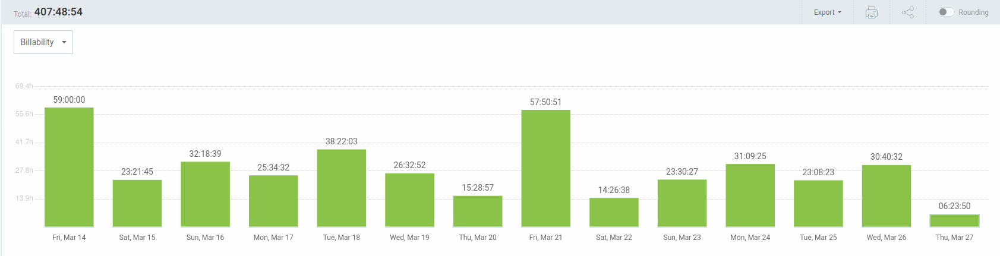

## Reporte de tiempo de Javier García Sebastián

**Periodo:** 21/02/2025 - 14/03/2025  
**Total de tiempo trabajado:** 23:37:23

### Proyecto Pawtel - Distribución del tiempo

| Descripción | Duración |
|-------------|---------|
| GUIÓN: dividir trabajo de presentación para el 14 | 00:18:07 |
| CLASE DEL 07/03/2025 | 04:00:00 |
| FRONTEND: perfil de usuario | 04:05:23 |
| FRONTEND: perfil de usuario (versión 2.0) | 03:48:43 |
| FRONTEND: perfil de usuario (arreglos) | 02:49:03 |
| Clase 21/02/2025 | 04:00:00 |
| Repaso slides 7/3/2025 | 00:28:58 |
| DOCUMENTACIÓN: organizar reporte del tiempo del equipo | 00:51:11 |
| PRESENTACIÓN: diapositivas presentación día 7/3/2025 | 02:26:48 |
| USUARIOS PILOTO: crear grupo y realizar encuesta para el feedback | 00:49:10 |

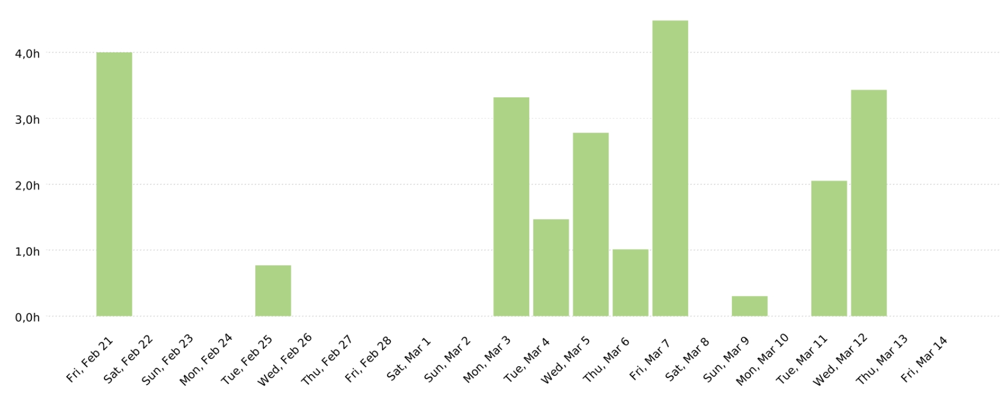

---

## Reporte de tiempo de Yesica Garate Fuentes

**Periodo:** 21/02/2025 - 14/03/2025  
**Total de tiempo trabajado:** 51:08:51

### Proyecto Pawtel - Distribución del tiempo

| Descripción | Duración |
|-------------|---------|
| Ajustes en Home Page según feedback recibido | 00:29:00 |
| Ajustes del desarrollo de la Presentación según el feedback recibido | 04:36:00 |
| Desarrollo de Presentación: Introducción, Business Model y Análisis del Proyecto | 07:07:00 |
| Creación de Mock-Ups en Balsamiq (Perfil de Usuario final, Home Page y Sobre Nosotros) | 03:44:58 |
| Creación de Mock-Ups en Balsamiq (Perfil de Usuario) | 04:54:00 |
| Desarrollo de Presentación: Introducción, Business Model y Análisis del Proyecto (SPRINT 01) | 00:37:10 |
| Clases - Presentación de Avance del Proyecto | 04:00:00 |
| Revisión y refinamiento de presentación (slides) | 02:52:00 |
| Autoformación en tecnologías y frameworks del proyecto I | 01:33:00 |
| Finalización versión 1.0 de Home Page | 03:25:00 |
| Maquetación de la pantalla Home Page (2 propuestas de prototipo) | 01:41:00 |
| Desarrollo de Presentación: Introducción, Business Model y Análisis del Proyecto II (SPRINT 01) | 03:30:33 |
| Ajustes del desarrollo de la Presentación según el feedback recibido II | 03:40:00 |
| Rehacer Home Page por error de comprensión | 03:14:00 |
| Creación del Documento de IA Usage | 00:18:10 |
| Autoformación en tecnologías y frameworks del proyecto II | 02:55:00 |
| Investigación y Estructura del Proyecto | 02:32:00 |

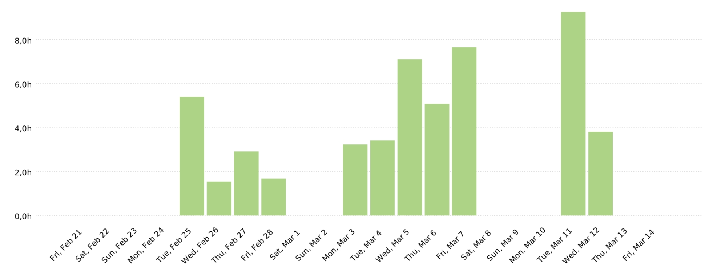
---

## Reporte de tiempo de Sergio Trenado Gonzalez

**Periodo:** 21/02/2025 - 14/03/2025  
**Total de tiempo trabajado:** 52:58:39

### Proyecto Pawtel - Distribución del tiempo

| Descripción | Duración |
|-------------|---------|
| Clase 14 mar | 04:00:00 |
| Feature: Pantalla de Listado de hoteles | 06:06:32 |
| Frontend Organización Sprint 1 | 04:04:04 |
| Resolviendo conflictos de una PR | 00:51:00 |
| Instalación proyecto | 00:23:20 |
| Reunión Primer Tercio Sprint 1 | 01:00:33 |
| Commits and PR | 00:12:02 |
| Informe de rendimiento | 01:03:07 |
| Informe de desempeño | 00:52:01 |
| Clase 7 mar | 04:00:00 |
| Haciendo web responsiva | 01:57:42 |
| Clase 21 feb | 04:00:00 |
| Reunión Inicio Sprint 1 | 01:11:00 |
| Fix pantalla detalles de hotel + merge main | 00:38:17 |
| Fixeando cosas | 00:29:27 |
| Reorganización y actualización del Excel de organización | 00:22:35 |
| Fix de imports + resolviendo dudas | 00:41:20 |
| Feature: Conectar Backend y Frontend | 05:33:48 |
| Instalación proyecto + componentes | 01:20:52 |
| Reunión Mitad Sprint 1 | 00:30:37 |
| Informe de trabajo - 6 mar | 00:23:27 |
| Feature: Crear Componentes Globales | 13:16:55 |

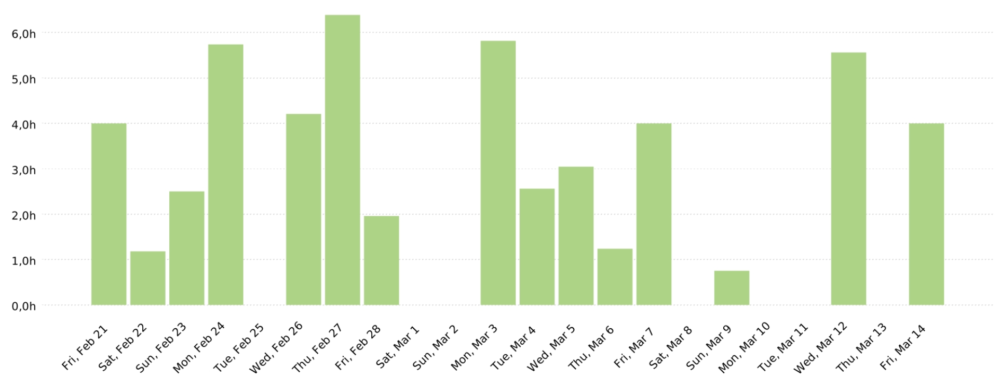
---

## Reporte de tiempo de Rafael Castillo Cebolla

**Periodo:** 21/02/2025 - 14/03/2025  
**Total de tiempo trabajado:** 58:12:11

### Proyecto Pawtel - Distribución del tiempo

| Descripción | Duración |
|-------------|---------|
| Rutas API | 02:45:00 |
| Preparar presentación | 01:00:00 |
| Reunión mitad de sprint 1 backend | 00:47:12 |
| QA y diseñar backend | 01:25:00 |
| Clases | 12:00:00 |
| Diseñando backend y QA | 02:10:00 |
| Preparar sprint 1 backend | 08:59:32 |
| Arreglando backend | 02:00:00 |
| Diseño backend + documentación + QA | 01:30:00 |
| QA Controladores y diseño | 03:00:00 |
| UML | 02:20:00 |
| Preparar entrega Devising a Project | 03:00:00 |

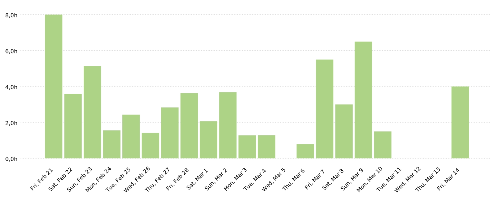
---

## Reporte de tiempo de Manuel Castillejo Vela

**Periodo:** 21/02/2025 - 14/03/2025  
**Total de tiempo trabajado:** 25:41:35

### Proyecto Pawtel - Distribución del tiempo

| Descripción | Duración |
|-------------|---------|
| Queries tanStack y configuración inicial de proyecto | 00:56:58 |
| Revisión del proyecto y base de conocimiento común | 01:10:12 |
| Pulir contributing.md | 01:05:10 |
| Adición de feedback a la base de datos común | 00:17:21 |
| Informe de IA | 00:29:47 |
| KBReport | 00:58:44 |
| Formación sobre TypeScript y TanStack | 00:22:02 |
| Clase | 08:00:00 |
| Queries tanStack | 04:35:09 |
| Gestión de usuarios pilotos | 02:39:48 |
| Screen Login and Register | 05:06:24 |

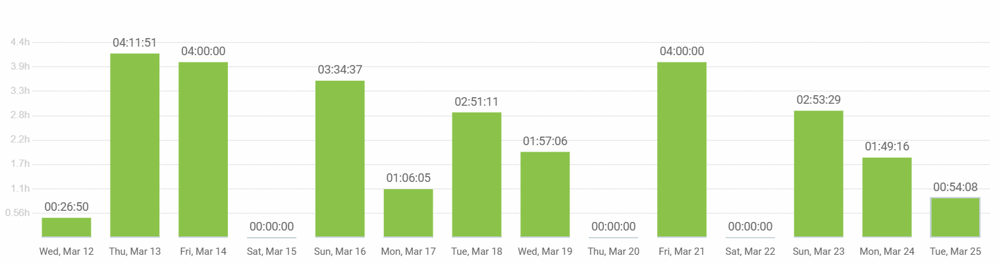
---

## Reporte de tiempo de Luis Mellado Diaz

**Periodo:** 21/02/2025 - 14/03/2025  
**Total de tiempo trabajado:** 38:26:28

### Proyecto Pawtel - Distribución del tiempo

| Descripción | Duración |
|-------------|---------|
| Medidas tras Reunión | 00:30:00 |
| Dirección Tras Seguimiento 1 | 01:25:54 |
| Clase 7/3 | 07:00:00 |
| QA KBreport | 00:22:00 |
| QA presentación | 00:36:12 |
| Panel CRUD de hoteles | 02:40:07 |
| Individual Performance | 00:59:24 |
| Informes de progreso | 00:15:00 |
| Informe de métricas y rendimiento | 01:04:01 |
| Preparación Reunión 03/03/2025 | 00:46:15 |
| Seeders | 01:10:00 |
| Crear Componentes Globales | 05:29:45 |
| Plantilla Acta Reunión | 00:31:20 |
| QA User profile screen and merge conflicts | 01:37:05 |
| QA Métricas y Rendimiento | 00:19:52 |
| Reunión 09/03/25 | 00:30:00 |
| Organización Presentación 07/03/2025 | 00:45:56 |
| UML Diagram | 01:29:22 |
| Métricas equipo de dirección | 00:22:08 |
| Clonado y setup del repositorio | 01:36:36 |
| QA User profile screen | 01:51:25 |
| Commitment Agreement | 00:15:00 |
| Reporte de Progreso 10/03/2025 | 00:11:26 |
| Revisar Presentación | 00:25:48 |
| Reunión Seguimiento Sprint 1 | 01:01:08 |
| Nueva plantilla Informe de IA | 00:22:38 |
| Registro de Incidencias | 01:05:27 |
| QA Encuesta Usuarios Piloto | 00:20:00 |
| Informe IA | 00:25:03 |
| Organización Sprint 1 | 01:10:00 |
| Organizar la documentación, pasar a md | 01:47:36 |

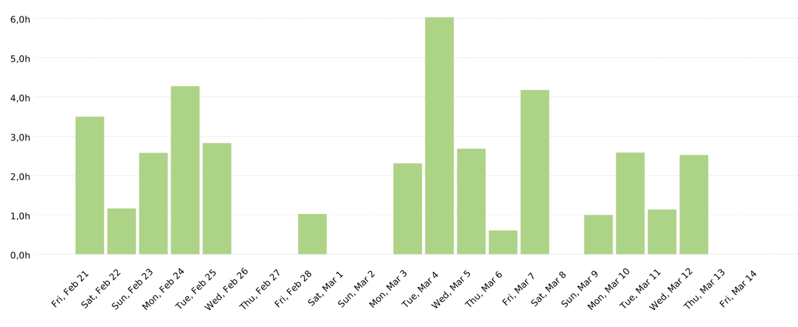
---

## Reporte de tiempo de Jorge Gomez de Tovar

**Periodo:** 21/02/2025 - 14/03/2025  
**Total de tiempo trabajado:** 20:20:00

### Proyecto Pawtel - Distribución del tiempo

| Descripción | Duración |
|-------------|---------|
| Controladores y servicios hotel y hotel owner | 09:40:00 |
| Clase | 08:00:00 |
| Reunión mitad de sprint 1 backend | 00:40:00 |
| Endpoints backend | 02:00:00 |

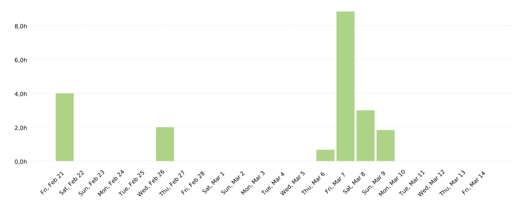
---

## Reporte de tiempo de Javier Ruiz Garrido

**Periodo:** 21/02/2025 - 14/03/2025  
**Total de tiempo trabajado:** 46:59:07

### Proyecto Pawtel - Distribución del tiempo

| Descripción | Duración |
|-------------|---------|
| Reunión mitad de sprint 1 backend | 00:38:41 |
| Backend: Servicios y controladores RoomType y Room | 09:52:40 |
| Devising a Project | 24:34:00 |
| Documentación: Informe uso de IA | 00:24:10 |
| Backend: Test de los serializadores | 04:38:37 |
| Backend: Llamadas API Room y RoomType | 02:00:00 |
| Documentación: Commitment Agreement de usuarios piloto | 00:50:59 |
| Clase | 04:00:00 |

---

## Reporte de tiempo de Francisco Miguel Jimenez Morales

**Periodo:** 21/02/2025 - 14/03/2025  
**Total de tiempo trabajado:** 48:11:30

### Proyecto Pawtel - Distribución del tiempo

| Descripción | Duración |
|-------------|---------|
| Fix PWA Structure | 01:08:29 |
| Preparar presentación | 05:04:22 |
| Clase | 04:00:00 |
| Convertir la SPA en una PWA instalable | 02:50:59 |
| Devising a Project | 26:11:11 |
| Gestión de usuarios pilotos - Redactar informe | 01:36:03 |
| Organización y planificación usuarios piloto | 01:59:22 |
| Gestión de usuarios pilotos | 01:29:57 |
| Ver tutoriales Vite + Vue PWA | 01:25:29 |
| Gestión de usuarios pilotos - Preparar informe | 00:58:56 |
| Informe IA | 00:05:08 |
| Preparar entorno de trabajo y ver tutoriales | 01:21:34 |

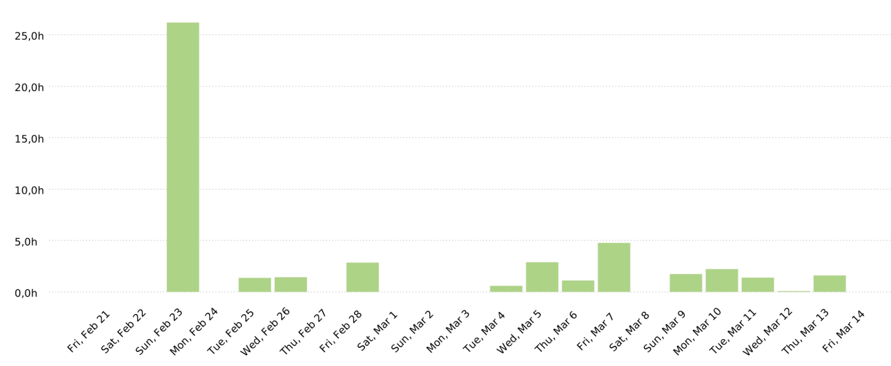
---

## Reporte de tiempo de Fernando Castelló Sanchez

**Periodo:** 21/02/2025 - 14/03/2025  
**Total de tiempo trabajado:** 24:30:27

### Proyecto Pawtel - Distribución del tiempo

| Descripción | Duración |
|-------------|---------|
| Documentación (Feedback), Reporte IA | 01:22:29 |
| Issues y Aprendizaje VUE | 01:03:37 |
| Frontend | 16:07:10 |
| Clase | 04:00:00 |
| Aprendizaje VUE | 01:01:21 |
| Feedback | 00:38:42 |
| Documentación (Feedback) | 00:17:08 |

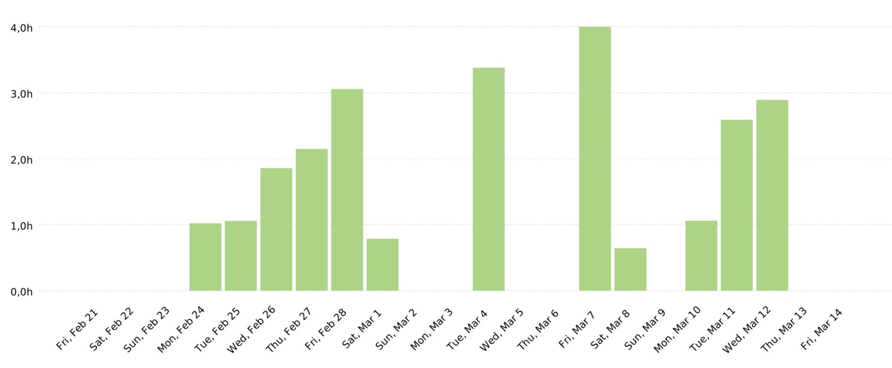
---

## Reporte de tiempo de David Gonzalez Martinez

**Periodo:** 21/02/2025 - 14/03/2025  
**Total de tiempo trabajado:** 32:59:06

### Proyecto Pawtel - Distribución del tiempo

| Descripción | Duración |
|-------------|---------|
| Deployment | 01:33:24 |
| Register/auth | 01:57:18 |
| Reunión | 00:31:24 |
| Organización | 00:05:01 |
| Conexión frontend-backend | 02:36:26 |
| Form | 00:04:11 |
| Preparar reunión | 00:09:00 |
| Misc, gestión | 00:23:00 |
| Clases | 04:00:00 |
| Desempeño | 00:38:39 |
| Reviews | 00:10:19 |
| Reunión jefes de equipo | 01:00:00 |
| Reunión Jefes | 01:10:00 |
| Deployment on Render | 01:41:44 |
| Ponerme al día, ver agenda reunión, review | 01:05:00 |
| QOL changes in frontend | 00:41:00 |
| Rendimiento | 00:42:22 |
| Review | 01:58:57 |
| Conexión backend-frontend | 01:48:00 |
| Misc | 05:39:21 |
| Planificación Full Stack | 01:04:00 |
| Clase | 04:00:00 |

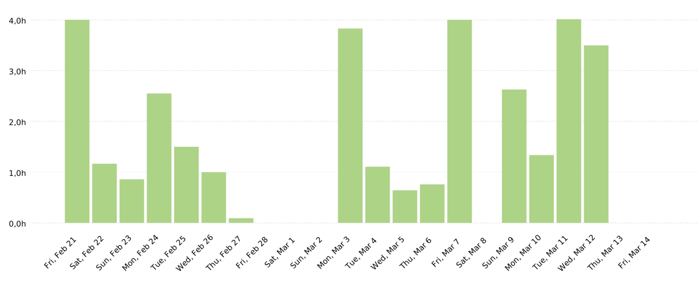
---

## Reporte de tiempo de Daniel Flores de Francisco

**Periodo:** 21/02/2025 - 14/03/2025  
**Total de tiempo trabajado:** 33:18:26

### Proyecto Pawtel - Distribución del tiempo

| Descripción | Duración |
|-------------|---------|
| Gestión Usuarios Piloto | 00:53:00 |
| Reporte de IA y QA presentación | 01:19:04 |
| Reunión Mitad Sprint | 00:34:00 |
| Reunión Inicial Sprint 1 | 01:30:00 |
| USAGE.md | 00:38:54 |
| Documento de la delivery. Métricas actualizadas y organización. | 02:30:00 |
| Configuración app | 00:47:09 |
| Tarea Semanal. Informe de Métricas usadas | 01:36:08 |
| Informe de desempeño, usuarios piloto y métricas. Presentación. | 01:31:01 |
| Dirección, gestión de usuarios piloto y cambios en el repo | 02:43:10 |
| CI. Pre-commit formatter. | 01:42:00 |
| Presentación con Claudio | 01:34:00 |
| Terminando documentación delivery | 01:46:11 |
| Weekly Contributing Report WF | 00:50:52 |
| Presentación | 04:00:43 |
| Clase ISPP | 08:00:00 |
| CI. Añadiendo Workflows | 01:22:14 |

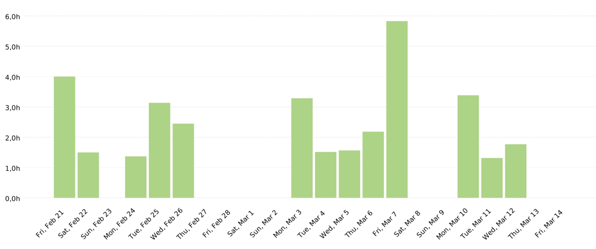
---

## Reporte de tiempo de Claudio Cortes Carrasco

**Periodo:** 21/02/2025 - 14/03/2025  
**Total de tiempo trabajado:** 30:35:55

### Proyecto Pawtel - Distribución del tiempo

| Descripción | Duración |
|-------------|---------|
| Clases | 08:00:00 |
| Presentación diapositivas y guión | 00:35:34 |
| Fix: corrección de feedback crear entidades y serializadores | 01:56:00 |
| Guión Presentación | 00:34:00 |
| Feedback Informes IA | 00:24:00 |
| Revisión de calidad en test de serializadores y modificaciones de entidades | 00:55:00 |
| Fix: aplicar feedback en modelos, serializadores y tests | 01:35:00 |
| Aprendizaje Django | 01:42:00 |
| Ayuda UML | 01:03:00 |
| Diapositivas Presentación | 02:14:41 |
| Lectura documentos | 00:33:00 |
| Feature: crear entidades y serializadores | 04:09:00 |
| Reporte de IA | 00:25:00 |
| Presentación | 00:48:33 |
| Feedback presentación | 00:26:00 |
| Reunión Backend | 00:40:43 |
| Presentación | 01:30:14 |
| Presentación semana 4 | 01:17:00 |
| Aplicar feedback a las diapositivas | 01:47:10 |

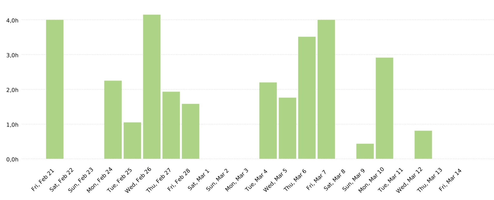
---

## Reporte de tiempo de Andres Martinez Revriego

**Periodo:** 21/02/2025 - 14/03/2025  
**Total de tiempo trabajado:** 14:21:36

### Proyecto Pawtel - Distribución del tiempo

| Descripción | Duración |
|-------------|---------|
| Informe de Tiempo | 00:05:00 |
| Informe de IA | 00:28:00 |
| Informe de IA actualizado | 00:17:00 |
| Tarea: Autenticación básica (frontend) | 07:05:53 |
| Formación de TypeScript, TanStack y PWA | 00:59:16 |
| Tarea: Autenticación básica (backend) | 02:26:15 |
| Lectura Documentación | 00:39:26 |
| Filtro de búsqueda | 02:20:46 |

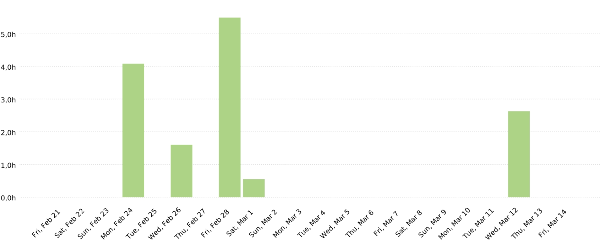

