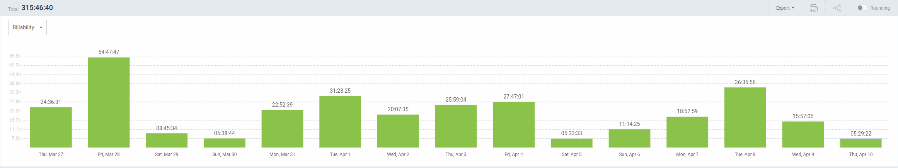
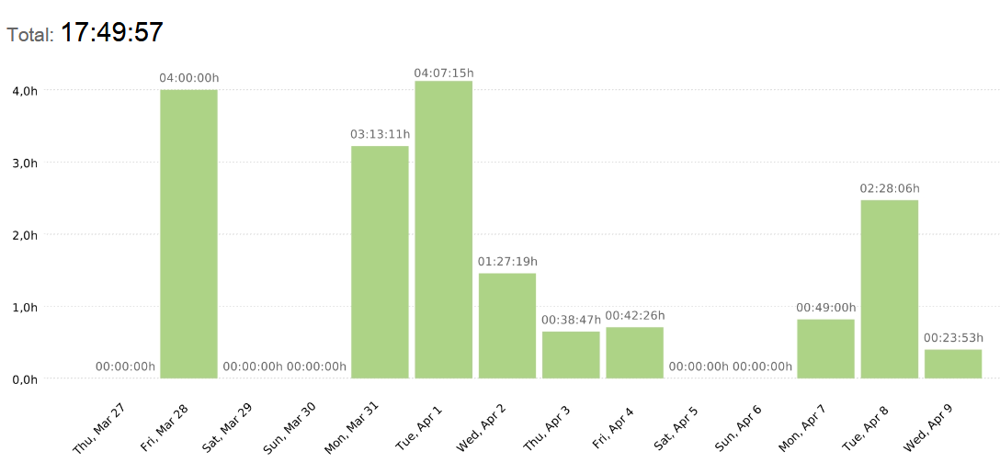

# 🐾🐕 Pawtel - 🏨 - Comparador de Hoteles para Mascotas 🐱🐾
**🎯Nuestra misión** es ofrecer una experiencia fácil e intuitva que permita encontrar el hospedaje perfecto para su mejor amigo.

🌍 **Visítanos en nuestra Página web y Redes sociales proximamente.**

📌 **Página Web:** [www.pawtel.es](https://www.pawtel.es)
📩 **Contáctanos:** [📧 hello@pawtel.es](mailto:chello@pawtel.es)

---

  

# 📑 **Reporte de Tiempo - Sprint 3** 🚀

**📅 Entregable:** Sprint 3
**📆 Fecha:** 08/04/2025
**👥 Equipo:** G11

|  |   |
|--------------------------|---|
| `Luis Mellado Díaz (PM🏆)` | `Daniel Flores De Francisco (PM🏆)` |
| Fernando Castelló Sánchez | Francisco Miguel Jiménez Morales |
| Javier García Sebastián | Javier Ruiz Garrido |
| Jorge Gómez de Tovar | Andrés Martínez Reviriego |
| Manuel Castillejo Vela | Rafael Castillo Cebolla |
| Claudio Cortés Carrasco | Sergio Trenado González |
| Yesica Garate Fuentes | David González Martínez |

---
## Historial de Versiones
| Fecha       | N° de Versión | Descripción               | Elaborado por           |
|-------------|---------------|---------------------------|-------------------------|
| 08/04/2025  | v 1.0         | Versión inicial del documento - Parte de Dani | Daniel Flores de Francisco |
| 08/04/2025  | v 1.1         | Informe de Luis| Luis Mellado Díaz |
| 09/04/2025  | v 1.2         | Informe de Sergio| Sergio Trenado González|
| 09/04/2025  | v 1.3         | Informe de Yesica| Yesica Garate Fuentes|
| 09/04/2025  | v 1.4         | Informe de Francisco| Francisco Miguel Jiménez Morales |
| 09/04/2025  | v 1.5         | Informe de Andrés| Andrés Martínez Reviriego |
| 09/04/2025  | v 1.6         | Informe de Fernando | Fernando Castelló Sánchez |
| 10/04/2025  | v 1.7         | Informe de David | David González Martínez |
| 10/04/2025  | v 1.8         | Informe de Javi | Javier García Sebastián |

---

## Gráfica que muestra el tiempo empleado por el grupo al completo

## Reporte de tiempo de Javier García Sebastián

**Periodo:** 27/03/2025 - 09/04/2025
**Total de tiempo trabajado:** 11:34:06

### Proyecto Pawtel - Distribución del tiempo

| Descripción | Duración |
|-------------|----------|
| informe de feedback de usuarios piloto | 00:44:33 |
| preparar presentación 28/03/2025 | 02:47:47 |
| clase 28/03/2025 | 04:00:00 |
| discusión sobre marketing via discord + creación de RRSS | 00:52:18 |
| GUIÓN: dividir trabajo de presentación para el 04 | 00:38:00 |
| GUIÓN: dividir trabajo de presentacion para el 11 | 00:48:19 |
| PRESENTACIÓN: diapositivas presentación 11/04/2025 | 00:51:11 |
| MARKETING: contenido redes sociales | 01:03:00 |

---

## Reporte de tiempo de Yesica Leydi Garate Fuentes

**Periodo:** 27/03/2025 - 09/04/2025
**Total de tiempo trabajado:** 32:11:00

### Proyecto Pawtel - Distribución del tiempo

| Descripción | Duración |
|-------------|---------|
| Mejoras del Storyboard de Inversores | 01:22:00|
| Desarrollo de Presentación: Planificacíon de Marketing II (SPRINT 03) | 01:55:00|
| Desarrollo de Presentación: Planificacíon de Marketing - Roles de Equipo (SPRINT 03)  | 00:50:00 |
| Modificaciones finales y Añadido Pantalla dirigido a Dueños de Alojamientos | 02:48:00|
| Modificación segun feedback de pantallas Home, Sobre Nosotros y Contact II | 06:12:00 |
| Modificación segun feedback de pantallas Home, Sobre Nosotros y Contact I | 03:50:00|
| Desarrollo de Presentación: Modificaciones a video de Anuncio, Planificación de Marketing | 01:57:00 |
| Clase 28 marzo                                                                                                   | 04:00:00  |
| Mejoras del Video de Anuncio dirigido a Dueños de Mascotas | 02:10:00|
| Desarrollo de Presentación: Planificación de Marketing | 01:25:00 |
| Desarrollo de Presentación: Rendimiento, Planificación de Marketing | 01:22:00|
| Planificación y Marketing: Investigación y desarrollo de Video de anuncio dirigido a Dueños de Mascotas | 04:20:00 |

---

## Reporte de tiempo de Sergio Trenado Gonzalez

**Periodo:** 27/03/2025 - 09/04/2025
**Total de tiempo trabajado:** 33:46:59

### Proyecto Pawtel - Distribución del tiempo

| Descripción                                                                                                      | Duración  |
|------------------------------------------------------------------------------------------------------------------|-----------|
| Clase 28 marzo                                                                                                   | 04:00:00  |
| Clase 4 abril                                                                                                    | 04:00:00  |
| Mejorar estilo de imágenes + Feature: Mejorar pantalla de "Detalles de hotel"                                     | 03:57:04  |
| PRs + Informe de horas + Feature: Pulir detalles de las pantallas                                                | 03:41:39  |
| Mejorando PR (CRUD Hoteles) + Feature: Mejorar pantalla de "Mis reservas" + Feature: Mejorar pantalla de "Detalles de hotel" | 03:01:00  |
| Mejorando PR (CRUD Hoteles)                                                                                      | 02:46:10  |
| Revisando + Mejorando PR (CRUD Hoteles)                                                                          | 02:01:01  |
| Terminos y condiciones + Fixeos + Iconos PWA                                                                     | 02:00:11  |
| Puliendo ultimos detalles y mejorando pantalla de admin                                                          | 01:46:41  |
| Arreglando diversas cosas del proyecto                                                                           | 01:44:14  |
| Mejorando el estilo y añadiendo paginaciones                                                                      | 01:39:42  |
| Reunión Inicio Sprint 3                                                                                          | 00:51:39  |
| Frontend Organización Sprint 3                                                                                   | 00:51:28  |
| Feature: Mejorar pantalla de "Mis reservas" + Feature: Mejorar pantalla de "Detalles de hotel"                     | 00:48:08  |
| Revisando PRs                                                                                                    | 00:38:02  |

---

## Reporte de tiempo de Rafael Castillo Cebolla

**Periodo:** 14/03/2025 - 26/03/2025
**Total de tiempo trabajado:** 38:42:00

### Proyecto Pawtel - Distribución del tiempo

| Descripción | Duración |
|-------------|---------|
| QA | 08:55:00 |
| Preparar entrega  | 01:03:00 |
| Revisar frontend | 03:00:00  |
| Booking Hold  | 03:42:00 |
| Clases | 4:00:00 |
| Tareas alta prioridad sprint 3 | 02:49:00 |
| Reunión | 01:00:00 |
| Hotfix | 02:46:00 |

---

## Reporte de tiempo de Manuel Castillejo Vela

**Periodo:** 27/03/2025 - 09/04/2025

**Total de tiempo trabajado:** 19:15:05

### Proyecto Pawtel - Distribución del tiempo
| Description                                           | Time (h) |
|-------------------------------------------------------|----------|
| KBReport                                              | 00:51:49 |
| Reunion semanal                                       | 00:41:14 |
| Clase                                                 | 04:00:00 |
| #271 Feature: Cover imagenes                          | 02:16:02 |
| SLA agreement y pricing                               | 01:08:13 |
| Informe de IA                                         | 00:25:58 |
| #276 Actualización cambios en tiempo real edit hotel | 00:35:00 |
| Adicion de feedback a la base de datos comun         | 00:47:30 |
| #237 Feature: Funcionamiento imagenes Frontend       | 08:29:19 |

---

## Reporte de tiempo de Luis Mellado Diaz

**Periodo:** 27/03/2025 - 09/04/2025

**Total de tiempo trabajado:** 20:45:57

### Proyecto Pawtel - Distribución del tiempo

| Descripción                         | Duración  |
|-------------------------------------|-----------|
| Reportes Tiempo Sprint 2            | 00:27:13  |
| QA-Entrega Sprint2                  | 02:48:00  |
| Individual Performance Sprint 2     | 01:42:01  |
| Reunión: Inicio Sprint 3            | 01:14:34  |
| Feat: Confirmación de Reserva       | 02:24:21  |
| Feat: Reservas de Hotel             | 00:39:27  |
| Fix: Lógica Rangos de Precio        | 00:55:49  |
| Refactor:  Pantalla busqueda hotel  | 04:48:54  |
| Presentación 4/4                    | 02:39:38  |
| Clase 4/4                           | 02:00:00  |
| Informe de IA Sprint 3              | 00:35:00  |
| Informe de Tiempo Sprint 3          | 00:31:00  |

---

## Reporte de tiempo de Jorge Gomez de Tovar

**Periodo:** 27/03/2025 - 09/04/2025
**Total de tiempo trabajado:** 20:20:00

| Descripción                           | Duración  |
|--------------------------------------|-----------|
| Clase                                | 08:00:00  |
| Informes de tiempo e IA              | 00:30:00  |
| Autenticar hotel owner aprobado      | 02:00:00  |
| Añadir imágenes reales al seeder     | 02:10:00  |
| Revisión PR mejorar autorización     | 00:40:00  |
| Investigar coverage                  | 01:00:00  |
| Añadir admin a backend               | 06:00:00  |

---

## Reporte de tiempo de Javier Ruiz Garrido

**Periodo:** 27/03/2025 - 09/04/2025
**Total de tiempo trabajado:** 18:42:52

### Proyecto Pawtel - Distribución del tiempo

| Descripción | Duración |
|-------------|---------|
| clase | 08:00:00 |
| Trabajos automatizados backend | 04:46:148 |
| Presentacion | 02:52:27 |
| Borrar booking hold activo al crear booking | 01:23:58 |
| Pequeños arreglos backend | 01:03:45 |
| Informes | 00:19:49 |
| Revision pr | 00:16:39 |

---

## Reporte de tiempo de Francisco Miguel Jiménez Morales

**Periodo:** 27/03/2025 - 10/04/2025
**Total de tiempo trabajado:** 18:18:22

### Proyecto Pawtel - Distribución del tiempo

| Descripción                                  | Duración   |
|----------------------------------------------|------------|
| Documentación Sprint                         | 00:20:00   |
| Preparar presentación                        | 00:45:29   |
| Clase                                        | 04:00:00   |
| Preparar presentación                        | 01:12:24   |
| Preparar presentación                        | 00:51:53   |
| Conexión Backend-frontend pantalla de usuario| 00:37:34   |
| Conexión Backend-frontend pantalla de usuario| 01:37:33   |
| Conexión Backend-frontend pantalla de usuario| 01:00:00   |
| Gestión de usuarios pilotos                  | 00:08:11   |
| Conexión Backend-frontend pantalla de usuario| 00:32:43   |
| Conexión Backend-frontend pantalla de usuario| 01:54:55   |
| Conexión Backend-frontend pantalla de usuario| 00:12:21   |
| Conexión Backend-frontend pantalla de usuario| 00:30:20   |
| Gestión de usuarios pilotos                  | 00:34:59   |
| Clase                                        | 04:00:00   |

---

## Reporte de tiempo de Fernando Castelló Sanchez

**Periodo:** 27/03/2025 - 10/04/2025
**Total de tiempo trabajado:** 23:02:13

### Proyecto Pawtel - Distribución del tiempo

| Descripción | Duración |
|-------------|---------|
| revision.md | 01:43:27 |
| Clase | 04:00:00 |
| Feedback | 00:44:09 |
| Frontend | 00:42:45 |
| Pantalla CRUD | 04:57:19 |
| Pantalla CRUD | 00:12:39 |
| Pantalla admin | 02:16:58 |
| Pantalla admin | 03:05:40 |
| Pantalla admin | 04:20:34 |
| revision.md | 00:50:31 |
| Informe IA | 00:08:11 |

---

## Reporte de tiempo de David Gonzalez Martinez

**Periodo:** 27/03/2025 - 10/04/2025
**Total de tiempo trabajado:** 19:40:23

### Proyecto Pawtel - Distribución del tiempo

| Descripción | Duración |
|-------------|---------|
| Tarea filtros globales | 01:38:22 |
| Miscelaneo/Review/Ayuda | 00:57:55 |
| Fix lots of bugs | 02:49:00 |
| Clase | 04:00:00 |
| Organización/Misc | 00:29:19 |
| Ver PR de Playwright, ver PR de validación | 00:14:19 |
| Tarea filtros globales / misc / review | 00:18:53 |
| Tarea filtros globales / misc | 01:26:11 |
| Misc | 02:32:07 |
| Gestionar contraseñas | 00:17:10 |
| Despliegue y retoques varios | 00:07:34 |
| Despliegue y retoques | 02:59:09 |
| Review | 00:26:24 |
| Reunión | 00:50:00 |
| Rendimiento y misc | 00:34:00 |

---

## Reporte de tiempo de Daniel Flores de Francisco

**Periodo:** 27/03/2025 - 10/04/2025
**Total de tiempo trabajado:** 24:58:22

### Proyecto Pawtel - Distribución del tiempo

| Tarea                                             | Tiempo    |
|---------------------------------------------------|-----------|
| Test EndToEnd Playwright                          | 01:59:00  |
| Ayudando Sergio Bug Finding                       | 00:36:00  |
| Delyvery and testing Pawtel                       | 03:30:00  |
| Playwright testing                                | 02:14:00  |
| USAGEmd for Playwright (PR review) and Customize Codacy | 01:11:00  |
| Playwright workflow configuration                 | 00:41:00  |
| Sprint 3 Documents Organization. Fixing minor issues | 02:09:22  |
| Clase ISPP                                        | 04:00:00  |
| Reunión Inicial Sprint 3                          | 01:15:00  |
| Playwright testing more screens                   | 02:00:00  |
| Usuarios piloto encuesta                          | 02:00:00  |
| Fixing frontend and deploy of Sprint 2            | 03:23:00  |

---

## Reporte de tiempo de Claudio Cortes Carrasco

**Periodo:** 14/03/2025 - 25/03/2025
**Total de tiempo trabajado:** 28:45:50

### Proyecto Pawtel - Distribución del tiempo

| Descripción | Duración |
|-------------|---------|
| Clases | 08:00:00 |
| Presentación Diapositivas | 01:22:00 |
| Video anuncio y diapositivas y guión | 01:25:00 |
| Presentación | 02:05:00 |
| Hacer documento feedback ispp | 00:16:00 |
| Añadir ruta de listado de hotel owner no validados y otra ruta para borrar hotel owner no validados | 02:09:06 |
| cambiar metodo de borrar hotel owner no validados por consistencia| 01:09:00 |
| graficas rendimiento y correciones varias | 01:45:09 |
| planificación marketing | 01:26:42 |
| presentación diapositivas y cambio storyboards| 01:22:23 |
|

---

## Reporte de tiempo de Andrés Martínez Reviriego

**Periodo:** 27/03/2025 - 09/04/2025
**Total de tiempo trabajado:** 17:49:57

### Proyecto Pawtel - Distribución del tiempo

| Descripción | Duración |
|-------------|---------|
| Mensajes de validación | 06:19:53 |
| Error getIp | 01:00:33 |
| Pantalla admin | 01:55:00 |
| Asistencia a clase | 04:00:00 |
| Informe de IA | 00:06:45 |
| Reestablecimiento de contraseña | 01:18:27 |
| Presentación | 03:09:19 |

