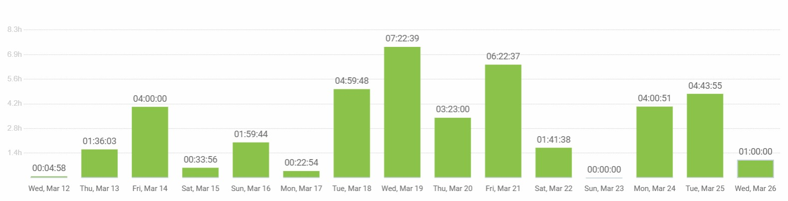

# 🐾🐕 Pawtel - 🏨 - Comparador de Hoteles para Mascotas 🐱🐾
**🎯Nuestra misión** es ofrecer una experiencia fácil e intuitva que permita encontrar el hospedaje perfecto para su mejor amigo.

  

 🌍 **Visítanos en nuestra Página web y Redes sociales proximamente.**

 📌 **Página Web:** [www.pawtel.es](https://www.pawtel.es)
 📩 **Contáctanos:** [📧 hello@pawtel.es](mailto:chello@pawtel.es)

---

  

# 📑 **Reporte de Tiempo - Sprint 3** 🚀 

**📅 Entregable:** Sprint 3
**📆 Fecha:** 08/04/2025
**👥 Equipo:** G11

|  |   |
|--------------------------|---|
| `Luis Mellado Díaz (PM🏆)` | `Daniel Flores De Francisco (PM🏆)` |
| Fernando Castelló Sánchez | Francisco Miguel Jiménez Morales |
| Javier García Sebastián | Javier Ruiz Garrido |
| Jorge Gómez de Tovar | Andrés Martínez Reviriego |
| Manuel Castillejo Vela | Rafael Castillo Cebolla |
| Claudio Cortés Carrasco | Sergio Trenado González |
| Yesica Garate Fuentes | David González Martínez |

---
## Historial de Versiones
| Fecha       | N° de Versión | Descripción               | Elaborado por           |
|-------------|---------------|---------------------------|-------------------------|
| 08/04/2025  | v 1.0         | Versión inicial del documento - Parte de Dani | Daniel Flores de Francisco |
| 08/04/2025  | v 1.1         | Informe de Luis| Luis Mellado Díaz |
| 09/04/2025  | v 1.2         | Informe de Sergio| Sergio Trenado González|

---

## Gráfica que muestra el tiempo empleado por el grupo al completo

## Reporte de tiempo de Javier García Sebastián

**Periodo:** 12/03/2025 - 26/03/2025
**Total de tiempo trabajado:** 28:20:57

### Proyecto Pawtel - Distribución del tiempo

| Descripción | Duración |
|-------------|----------|
| GUIÓN: dividir trabajo de presentación para el 21 | 00:28:29 |
| clase 14/03/2025 | 04:00:00 |
| FRONTEND: perfil de usuario (versión 3.0) | 02:13:45 |
| FRONTEND: perfil de usuario (versión 2.0) | 02:34:43 |
| FRONTEND: corregir errores perfil de usuario | 00:20:42 |
| clase 21/03/2025 | 04:00:00 |
| preparar presentación 21/03/2025 | 04:57:21 |
| DOCUMENTACIÓN: organizar reporte del tiempo del equipo | 00:51:11 |
| PRESENTACION: diapositivas presentacion dia 14/3/2025 | 01:50:38 |
| conectar pantalla de UserProfile con backend | 01:45:58 |
| GUIÓN: dividir trabajo de presentación para el 28 | 00:29:00 |

---

## Reporte de tiempo de Yesica Leydi Garate Fuentes

**Periodo:** 12/03/2025 - 26/03/2025
**Total de tiempo trabajado:** 40:54:19

### Proyecto Pawtel - Distribución del tiempo

| Descripción | Duración |
|-------------|---------|
| Desarrollo de Presentación: Introduccion, Business Model, StoryBoard y Uso de la IA (SPRINT 02) | 04:42:00|
| Ajuste y Finalización de StoryBoards para capturar audiencia II | 02:35:00 |
| Ajuste y Finalización de StoryBoards para capturar audiencia I | 04:22:00 |
| Desarrollo de Presentación: Impacto legal del Proyecto | 03:10:00 |
| Desarrollo de StoryBoards para capturar audiencia I | 04:30:00 |
| Ajuste y Finalización de Mockups según el Backend II | 03:56:00|
| Ajuste y Finalización de Mockups según el Backend I | 03:23:28|
| Clases - Presentación de Avance del Proyecto SPRINT1| 04:00:00 |
| Tareas varias para la entrega del proyecto (SPRINT 01) | 06:30:00 |
| Desarrollo de Presentación: Introduccion, Business Model y Analisis del Proyecto  FINAL (SPRINT 01) | 03:45:00 |
| Reunión Imprevista de emergencia | 00:38:43 |
| Desarrollo de Presentación: Introduccion, Business Model y Analisis del Proyecto III (SPRINT 01) | 03:00:26 |
| Creacion del Documento de IA Usage | 00:18:10 |
| Desarrollo de Presentación: Introduccion, Business Model y Analisis del Proyecto II (SPRINT 01) | 03:30:33 |
| Desarrollo de Presentación: Introduccion, Business Model y Analisis del Proyecto (SPRINT 01) | 04:00:00 |
| Creación de Mock-Ups en Balsamiq (Perfil de Usuario final, Home Page y Sobre Nosotros) | 03:44:58 |
| Creación de Mock-Ups en Balsamiq (Perfil de Usuario) | 04:54:00 |
| Ajustes del desarrollo de la Presentación según el feedback recibido II | 03:40:00 |
| Ajustes en Home Page según feedback recibido | 00:29:00 |
| Ajustes del desarrollo de la Presentación según el feedback recibido | 04:36:00 |
| Desarrollo de Presentación: Introducción, Business Model y Análisis del Proyecto | 07:07:00 |
| Creación de Mock-Ups en Balsamiq (Perfil de Usuario final, Home Page y Sobre Nosotros) | 03:44:58 |
| Creación de Mock-Ups en Balsamiq (Perfil de Usuario) | 04:54:00 |
| Desarrollo de Presentación: Introducción, Business Model y Análisis del Proyecto (SPRINT 01) | 00:37:10 |
| Revisión y refinamiento de presentación (slides) | 02:52:00 |
| Autoformación en tecnologías y frameworks del proyecto I | 01:33:00 |
| Finalización versión 1.0 de Home Page | 03:25:00 |
| Maquetación de la pantalla Home Page (2 propuestas de prototipo) | 01:41:00 |
| Desarrollo de Presentación: Introducción, Business Model y Análisis del Proyecto II (SPRINT 01) | 03:30:33 |
| Ajustes del desarrollo de la Presentación según el feedback recibido II | 03:40:00 |
| Rehacer Home Page por error de comprensión | 03:14:00 |
| Creación del Documento de IA Usage | 00:18:10 |
| Autoformación en tecnologías y frameworks del proyecto II | 02:55:00 |
| Investigación y Estructura del Proyecto | 02:32:00 |

---

## Reporte de tiempo de Sergio Trenado Gonzalez

**Periodo:** 27/03/2025 - 09/04/2025
**Total de tiempo trabajado:** 33:46:59

### Proyecto Pawtel - Distribución del tiempo

| Descripción                                                                                                      | Duración  |
|------------------------------------------------------------------------------------------------------------------|-----------|
| Clase 28 marzo                                                                                                   | 04:00:00  |
| Clase 4 abril                                                                                                    | 04:00:00  |
| Mejorar estilo de imágenes + Feature: Mejorar pantalla de "Detalles de hotel"                                     | 03:57:04  |
| PRs + Informe de horas + Feature: Pulir detalles de las pantallas                                                | 03:41:39  |
| Mejorando PR (CRUD Hoteles) + Feature: Mejorar pantalla de "Mis reservas" + Feature: Mejorar pantalla de "Detalles de hotel" | 03:01:00  |
| Mejorando PR (CRUD Hoteles)                                                                                      | 02:46:10  |
| Revisando + Mejorando PR (CRUD Hoteles)                                                                          | 02:01:01  |
| Terminos y condiciones + Fixeos + Iconos PWA                                                                     | 02:00:11  |
| Puliendo ultimos detalles y mejorando pantalla de admin                                                          | 01:46:41  |
| Arreglando diversas cosas del proyecto                                                                           | 01:44:14  |
| Mejorando el estilo y añadiendo paginaciones                                                                      | 01:39:42  |
| Reunión Inicio Sprint 3                                                                                          | 00:51:39  |
| Frontend Organización Sprint 3                                                                                   | 00:51:28  |
| Feature: Mejorar pantalla de "Mis reservas" + Feature: Mejorar pantalla de "Detalles de hotel"                     | 00:48:08  |
| Revisando PRs                                                                                                    | 00:38:02  |

---

## Reporte de tiempo de Rafael Castillo Cebolla

**Periodo:** 14/03/2025 - 26/03/2025
**Total de tiempo trabajado:** 38:42:00

### Proyecto Pawtel - Distribución del tiempo

| Descripción | Duración |
|-------------|---------|
| QA | 08:55:00 |
| Preparar entrega  | 01:03:00 |
| Revisar frontend | 03:00:00  |
| Booking Hold  | 03:42:00 |
| Clases | 4:00:00 |
| Tareas alta prioridad sprint 3 | 02:49:00 |
| Reunión | 01:00:00 |
| Hotfix | 02:46:00 |

---

## Reporte de tiempo de Manuel Castillejo Vela

**Periodo:** 12/03/2025 - 25/03/2025
**Total de tiempo trabajado:** 27:44:33

### Proyecto Pawtel - Distribución del tiempo

| Description                                                   | Time (h)  |
|---------------------------------------------------------------|-----------|
| #181 Feature: Hotel owner queries Tan Stack                 | 00:22:00  |
| Mensajes CRUD creación hoteles                              | 00:54:36  |
| KBReport                                                    | 00:51:33  |
| #158 Feature: Validación de formularios con librerías.     | 07:07:27  |
| Clase                                                       | 08:00:00  |
| #205 Feature: Actualizar queries de Tan Stack con nuevas URLs | 03:29:51  |
| #225 Feature: Mejorar funcionalidad Hotel Details          | 00:54:08  |
| Añadir mensajes de error al frontend y botones de login y register | 03:17:15  |
| Informe de IA                                              | 00:26:50  |
| Adición de feedback a la base de datos común               | 02:06:45  |
| Calendario de usuarios pilotos sprint 2                    | 00:14:08  |

---

## Reporte de tiempo de Luis Mellado Diaz

**Periodo:** 25/03/2025 - 18/03/2025
**Total de tiempo trabajado:** 20:45:57

### Proyecto Pawtel - Distribución del tiempo

| Descripción                         | Duración  |
|-------------------------------------|-----------|
| Reportes Tiempo Sprint 2            | 00:27:13  |
| QA-Entrega Sprint2                  | 02:48:00  |
| Individual Performance Sprint 2     | 01:42:01  |
| Reunión: Inicio Sprint 3            | 01:14:34  |
| Feat: Confirmación de Reserva       | 02:24:21  |
| Feat: Reservas de Hotel             | 00:39:27  |
| Fix: Lógica Rangos de Precio        | 00:55:49  |
| Refactor:  Pantalla busqueda hotel  | 04:48:54  |
| Presentación 4/4                    | 02:39:38  |
| Clase 4/4                           | 02:00:00  |
| Informe de IA Sprint 3              | 00:35:00  |
| Informe de Tiempo Sprint 3          | 00:31:00  |

---

## Reporte de tiempo de Jorge Gomez de Tovar

**Periodo:** 12/03/2025 - 26/03/2025
**Total de tiempo trabajado:** 29:52:00

### Proyecto Pawtel - Distribución del tiempo

| Descripción | Duración |
|-------------|---------|
| Revisión frontend | 00:45:00 |
| Mensajes error login y register | 01:30:00 |
| Actualizar covers de HotelImage | 02:50:00 |
| Revisión PR autorización | 00:30:00 |
| Restricciones hotel image test y seeders | 05:55:00 |
| Revisión Pull-request Image handling | 00:52:00 |
| Clase | 08:00:00 |
| Revisión PR refactorizar | 00:30:00 |
| Arreglar error en seeder | 00:30:00 |
| Autorización y permiso controladores y servicios | 06:30:00 |
| Informe IA | 00:30:00 |
| Revisión PR filtros room type | 01:00:00 |
| Añadir endpoints a documento rutas API | 00:30:00 |

---

## Reporte de tiempo de Javier Ruiz Garrido

**Periodo:** 12/03/2025 - 25/03/2025
**Total de tiempo trabajado:** 29:52:11

### Proyecto Pawtel - Distribución del tiempo

| Descripción | Duración |
|-------------|---------|
| Logica de archivado y borrado | 00:35:40 |
| Logica de archivado y borrado | 02:37:18 |
| Rehacer filtros de hoteles y rooms | 00:31:44 |
| Logica de archivado y borrado | 01:40:52 |
| Rehacer filtros de hoteles y rooms | 01:12:49 |
| Rehacer filtros de hoteles y rooms | 00:45:51 |
| Rehacer filtros de hoteles y rooms | 01:17:04 |
| Rehacer filtros de hoteles y rooms | 00:54:30 |
| clase | 04:00:00 |
| Rehacer filtros de hoteles y rooms | 01:53:22 |
| Rehacer filtros de hoteles y rooms | 00:47:26 |
| Rehacer filtros de hoteles y rooms | 00:23:27 |
| clase | 04:00:00 |
| review pr | 00:28:29 |
| fix migrations | 00:36:10 |
| BookingHold seeder | 01:16:21 |
| Refactorizacion variada backend | 01:17:16 |
| Refactorizacion variada backend | 02:07:58 |
| Refactorizacion variada backend | 03:02:39 |
| Revision Pull Request | 00:17:34 |
| clase | 04:00:00 |

---

## Reporte de tiempo de Francisco Miguel Jiménez Morales

**Periodo:** 12/03/2025 - 26/03/2025
**Total de tiempo trabajado:** 42:12:03

### Proyecto Pawtel - Distribución del tiempo

| Descripción | Duración |
|-------------|---------|
| Preparar presentación | 01:00:00 |
| Feedback revisión | 02:29:26 |
| Feedback revisión | 00:59:32 |
| Solucionar conflictos | 00:21:49 |
| Solucionar conflictos | 00:53:08 |
| Implementar pasarela de pago | 02:20:45 |
| Implementar pasarela de pago | 00:58:04 |
| Implementar pasarela de pago | 00:42:02 |
| Implementar pasarela de pago | 01:08:38 |
| Implementar pasarela de pago | 00:33:00 |
| Clase | 04:00:00 |
| Implementar pasarela de pago | 00:56:15 |
| Implementar pasarela de pago | 01:26:22 |
| Preparar presentación | 02:28:56 |
| Implementar pasarela de pago | 00:54:04 |
| Implementar pasarela de pago | 03:14:39 |
| Preparar presentación | 00:17:40 |
| Implementar pasarela de pago | 00:44:44 |
| Organización y planificación usuarios piloto | 00:03:03 |
| Implementar pasarela de pago | 00:53:35 |
| Implementar pasarela de pago | 00:24:48 |
| Implementar pasarela de pago | 01:09:54 |
| Organización y planificación usuarios piloto | 00:34:16 |
| Implementar pasarela de pago | 00:41:10 |
| Implementar pasarela de pago | 02:05:56 |
| Implementar pasarela de pago | 02:12:42 |
| Organización y planificación usuarios piloto | 00:22:54 |
| Implementar pasarela de pago | 01:59:44 |
| Misc | 00:33:56 |
| Clase | 04:00:00 |
| Gestión de usuarios pilotos - Redactar informe | 01:36:03 |
| Preparar presentación | 00:04:58 |

---

## Reporte de tiempo de Fernando Castelló Sanchez

**Periodo:** 12/03/2025 - 26/03/2025
**Total de tiempo trabajado:** 28:14:33

### Proyecto Pawtel - Distribución del tiempo

| Descripción | Duración |
|-------------|---------|
| Documentación (Feedback), Reporte IA | 01:22:29 |
| Frontend | 02:40:09 |
| revision.md | 01:38:19 |
| Reunión | 00:44:27 |
| Clase | 04:00:00 |
| Documentación (Feedback) | 01:24:51 |
| Frontend | 02:02:02 |
| Frontend | 02:10:12 |
| Frontend | 00:20:50 |
| Clase | 04:00:00 |
| Documentación (Feedback) | 01:01:27 |
| Frontend | 01:17:17 |
| Frontend | 00:17:59 |
| Frontend | 02:23:00 |
| Frontend, Informe IA | 02:51:31 |

---

## Reporte de tiempo de David Gonzalez Martinez

**Periodo:** 12/03/2025 - 26/03/2025
**Total de tiempo trabajado:** 42:16:15

### Proyecto Pawtel - Distribución del tiempo

| Descripción                                 | Duración   |
|---------------------------------------------|------------|
| Clase                                       | 04:00:00   |
| Reunion                                     | 01:00:00   |
| Fix bug                                     | 00:42:21   |
| Autenticacion                               | 02:34:52   |
| Conexion frontend backend                   | 02:36:26   |
| Performance                                 | 00:17:19   |
| Review                                      | 00:43:57   |
| Reunión de urgencia                         | 00:47:00   |
| Review/Trabajo en Reservas                  | 00:31:43   |
| Planificar                                  | 00:10:58   |
| Ayudar                                      | 01:10:18   |
| Workflow                                    | 00:10:00   |
| Review pagos/reservas                       | 00:20:13   |
| Actualizarme, aclarar dudas, cosas varias   | 00:50:00   |
| Fix double login bug                        | 00:02:00   |
| Review/Fix bugs in frontend permissions     | 00:26:17   |
| Review PR Andres                            | 00:08:46   |
| Documentos                                  | 00:14:55   |
| Review/Misc                                 | 00:30:03   |
| Pulir reservas                              | 01:48:27   |
| Mirar bug autenticacion                     | 00:10:12   |
| Reviews, aclarar dudas, misc                | 00:47:00   |
| Refactorizacion frontend                    | 01:25:18   |
| Bug                                         | 00:16:49   |
| Ver problema compañero                      | 00:32:00   |
| Images                                      | 03:49:39   |
| Reunion y organizacion                      | 01:42:00   |
| Misc                                        | 05:42:04   |
| Documento guidelines frontend/feedback pantallas | 01:23:49   |
| Deployment                                  | 02:20:12   |
| Permissions in frontend                     | 00:53:26   |
| Class                                       | 04:00:00   |
| Review a lo de Andrés                       | 00:08:11   |

---

## Reporte de tiempo de Daniel Flores de Francisco

**Periodo:** 12/03/2025 - 26/03/2025
**Total de tiempo trabajado:** 30:42:28

### Proyecto Pawtel - Distribución del tiempo

| Descripción | Duración |
|-------------|---------|
| Delirvery Sprint 1 (No se conto en el anterior sprint)                                      | 06:00:00   |
| Workflow for testing django                              | 01:41:00   |
| EditHotelScreen fix. Double Requests fix.               | 02:47:00   |
| Preparar presentación                                    | 01:30:00   |
| Presentation. Arreglar petición back. Arreglar y mergear CI. Arreglar Queries. Aumento Calidad de Código. | 02:13:37   |
| Presentacio. Slides                                      | 02:00:35   |
| Integración con Codacy y Workflow                       | 01:30:00   |
| Terminos y Condiciones. Back                            | 01:47:32   |
| Clase ISPP                                              | 04:00:00   |
| Delivery Sprint 2  Preparación de docs                                     | 00:34:00   |
| Reunion Sprint 2                                        | 01:00:00   |
| Metrics with SonarQube                                  | 01:00:00   |
| Terminando documentación delivery                       | 01:46:11   |
| Customer Agreement, Presentation and Feedback. Arreglando CI | 01:54:00   |
| QA de las PR. Fixing Codacy Issues | 00:58:33   |

---

## Reporte de tiempo de Claudio Cortes Carrasco

**Periodo:** 14/03/2025 - 25/03/2025
**Total de tiempo trabajado:** 28:45:50

### Proyecto Pawtel - Distribución del tiempo

| Descripción | Duración |
|-------------|---------|
| Clases | 06:00:00 |
| Feature: Creación bookings | 05:02:39 |
| Fix: arreglar bookings | 00:23:00 |
| fix: arreglar tests bookings | 00:49:00 |
| feat: crear metodos de getAllBokings por customer y hotel mas sus tests | 03:15:00 |
| feat: crear room_type_is_available method and tests | 02:29:00 |
| feat: crear metodos para obtener bookings por hotel y por customer. | 04:17:00 |
| task: revisar documentación Api automática | 02:23:00 |
| revisar frontend | 01:02:00 |
| feat: añadir atributo is_approved a hotel_owner | 01:49:11 |
| presentación diapositivas | 00:41:00 |
| Reporte de IA y de tiempo| 00:35:00 |

---

## Reporte de tiempo de Andres Martinez Revriego

**Periodo:** 12/03/2025 - 26/03/2025
**Total de tiempo trabajado:** 37:38:54

### Proyecto Pawtel - Distribución del tiempo

| Descripción | Duración |
|-------------|---------|
| Informe IA y tiempo | 00:04:55 |
| Evidencias términos y condiciones | 01:54:40 |
| Presentación | 04:11:09 |
| Informe de IA | 00:14:00 |
| Asistencia a clase | 04:00:00 |
| Reestablecimiento de contraseña | 05:20:55 |
| Customer | 04:36:19 |
| Asistencia a clase | 04:00:00 |
| Revisión código filtros | 01:06:48 |
| Ayuda con revisión.md | 00:24:29 |
| Filtros | 04:11:56 |
| Editar hoteles | 02:17:56 |
| Reunión de emergencia | 00:47:27 |
| Editar hoteles | 01:50:34 |
| Filtro de búsqueda | 02:20:46 |
| Informe de IA actualizado | 00:17:00 |

