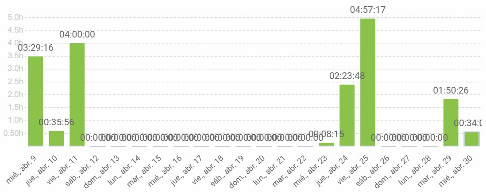
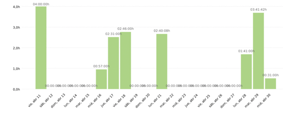

# 🐾🐕 Pawtel - 🏨 - Comparador de Hoteles para Mascotas 🐱🐾
**🎯Nuestra misión** es ofrecer una experiencia fácil e intuitva que permita encontrar el hospedaje perfecto para su mejor amigo.

🌍 **Visítanos en nuestra Página web y Redes sociales proximamente.**

📌 **Página Web:** [www.pawtel.es](https://www.pawtel.es)
📩 **Contáctanos:** [📧 hello@pawtel.es](mailto:chello@pawtel.es)

---

  

# 📑 **Reporte de Tiempo - PPL** 🚀

**📅 Entregable:** WPL
**📆 Fecha:** 22/05/2025
**👥 Equipo:** G11

|  |   |
|--------------------------|---|
| `Luis Mellado Díaz (PM🏆)` | `Daniel Flores De Francisco (PM🏆)` |
| Fernando Castelló Sánchez | Francisco Miguel Jiménez Morales |
| Javier García Sebastián | Javier Ruiz Garrido |
| Jorge Gómez de Tovar | Andrés Martínez Reviriego |
| Manuel Castillejo Vela | Rafael Castillo Cebolla |
| Claudio Cortés Carrasco | Sergio Trenado González |
| Yesica Garate Fuentes | David González Martínez |

---
## Historial de Versiones
| Fecha       | N° de Versión | Descripción               | Elaborado por           |
|-------------|---------------|---------------------------|-------------------------|
| 22/05/2025  | v 1.0         | Versión inicial del documento - Parte de Luis | Luis Mellado Díaz |
| 22/05/2025  | v 1.1         | Parte Francisco | Francisco Miguel Jiménez Morales |

---

## Gráfica que muestra el tiempo empleado por el grupo al completo

## Reporte de tiempo de Javier García Sebastián

**Periodo:** 09/04/2025 - 30/04/2025
**Total de tiempo trabajado:** 16:06:05

### Proyecto Pawtel - Distribución del tiempo

| Descripción                                                    | Duración   |
|----------------------------------------------------------------|------------|
| creación de protopersonas siguiendo feedback                   | 00:25:00   |
| creación imágenes posts Instagram                              | 00:52:17   |
| doblar anuncio Javi y Coco                                     | 02:25:42   |
| reunión marketing y RRSS                                       | 00:16:00   |
| creación cartel publicitario Pawtel                            | 01:46:56   |
| preparar y subir 2do post + presentación                       | 00:46:56   |
| clase 25/04/2025                                               | 04:00:00   |
| PRESENTACIÓN: diapositivas presentación 11/04/2025             | 00:40:09   |
| preparar presentación 25/04                                    | 02:04:42   |
| últimos informes sprint → IA, horas y feedback usuarios piloto | 00:44:45   |
| documento de costes de marketing a nivel RRSS                  | 00:35:38   |
| horario de hoy a mayo RRSS                                     | 01:28:00   |

---

## Reporte de tiempo de Yesica Leydi Garate Fuentes

**Periodo:** 10/04/2025 - 30/04/2025
**Total de tiempo trabajado:** 32:21:00

### Proyecto Pawtel - Distribución del tiempo

| Descripción | Duración |
|-------------|---------|
| Actualización de reportes individual personal | 01:10:00 |
| Diseño de carteles para presentación oficial - Marketing | 03:48:00 |
| Desarrollo de Presentación II - Marketing (PPL) | 03:59:00 |
| Gestión de RRSS | 03:34:00 |
| Recopilar recursos visuales (Post, Stories, Reels, videos, etc) II | 04:15:00 |
| Corrección de materiales audiovisuales - Video de Inversores | 00:23:00 |
| Cronograma de publicaciones en RRSS | 02:02:00 |
| Desarrollo de Presentación: Marketing (PPL) | 02:11:00 |
| Gestión de RRSS | 03:55:00 |
| Video anuncio orientado a inversores | 01:00:00  |
| Recursos Redes Sociales | 01:11:00|
| Costes de marketing | 01:30:00 |
| Recopilar recursos visuales (Post, Stories, Reels, videos, etc) I | 05:22:00 |
| Definir la plantilla para la presentación | 02:01:00 |

---

## Reporte de tiempo de Sergio Trenado Gonzalez

**Periodo:** 09/04/2025 - 30/04/2025
**Total de tiempo trabajado:** 11:44:37

### Proyecto Pawtel - Distribución del tiempo

| Descripción                                                                                                      | Duración  |
|------------------------------------------------------------------------------------------------------------------|-----------|
| Clase 25 abril                                                                                                   | 04:00:00  |
| Clase 11 abril                                                                                                   | 04:00:00  |
| Puliendo ultimos detalles y mejorando pantalla de admin                                                          | 01:46:41  |
| Mejorando detalles y arreglando bugs  + IA Report                                                                | 01:24:23  |
| Mejorando detalles y arreglando bugs                                                                             | 00:33:33  |

---

## Reporte de tiempo de Rafael Castillo Cebolla

**Periodo:** 10/04/2025 - 30/04/2025
**Total de tiempo trabajado:** 22:43:00

### Proyecto Pawtel - Distribución del tiempo

| Descripción | Duración |
|-------------|---------|
| QA | 05:50:00 |
| Arreglar error backen  | 06:36:00 |
| Pawtel points | 04:17:00  |
| Clases  | 06:00:00 |

---

## Reporte de tiempo de Manuel Castillejo Vela

**Periodo:** 30/04/2025 - 22/05/2025

**Total de tiempo trabajado:** 09:09:34

### Proyecto Pawtel - Distribución del tiempo
| Description                                     | Time (h)   |
|-------------------------------------------------|------------|
| Informe de IA                                   | 00:21:24   |
| Presentacion individual                         | 00:22:12   |
| #291 Feature: Desarrollo Android                | 01:04:14   |
| KBReport                                        | 00:41:29   |
| Adicion de feedback a la base de datos comun    | 00:48:47   |
| Despliegue play store                           | 01:51:28   |
| Clase                                           | 04:00:00   |

---

## Reporte de tiempo de Luis Mellado Diaz

**Periodo:** 02/05/2025 - 22/05/2025

**Total de tiempo trabajado:** 5:28:00

### Proyecto Pawtel - Distribución del tiempo

| Descripción                         | Duración  |
|-------------------------------------|-----------|
| Entrega WPL                         | 01:20:00  |
| Presentación WPL                    | 02:18:00  |
| Presentación de Desempeño           | 01:50:00  |

---

## Reporte de tiempo de Jorge Gomez de Tovar

**Periodo:** 09/04/2025 - 30/04/2025
**Total de tiempo trabajado:** 13:00:00

| Descripción                           | Duración  |
|--------------------------------------|-----------|
| Clase                                | 08:00:00  |
| Informes de tiempo e IA              | 00:30:00  |
| Presentación PPL                     | 04:30:00  |

---

## Reporte de tiempo de Javier Ruiz Garrido

**Periodo:** 10/04/2025 - 22/05/2025
**Total de tiempo trabajado:** 22:50:55

### Proyecto Pawtel - Distribución del tiempo

| Descripción | Duración |
|-------------|---------|
| clase | 12:00:00 |
| Presentacion WPL | 05:19:46 |
| preparacion WPL | 04:00:05 |
| presentacion | 02:52:27 |
| informes | 00:53:49 |
| arreglos presentacion | 00:35:56 |
| Informe tiempo | 00:17:00 |

---

## Reporte de tiempo de Francisco Miguel Jiménez Morales

**Periodo:** 11/04/2025 - 02/05/2025
**Total de tiempo trabajado:** 20:28:09

### Proyecto Pawtel - Distribución del tiempo

| Descripción                                  | Duración   |
|----------------------------------------------|------------|
| Editar video demo técnica                    | 03:30:00   |

---

## Reporte de tiempo de Fernando Castelló Sanchez

**Periodo:** 10/04/2025 - 22/05/2025
**Total de tiempo trabajado:** 13:42:59

### Proyecto Pawtel - Distribución del tiempo

| Descripción | Duración |
|-------------|---------|
| Clase | 04:00:00 |
| Feedback | 00:24:23 |
| Presentación | 00:19:44 |
| Presentación | 02:16:53 |
| Presentación | 00:58:44 |
| Presentación | 00:32:17 |
| Presentación | 00:05:19 |
| Clase | 04:00:00 |
| Feedback | 00:28:31 |
| Presentación | 00:28:07 |
| Informe IA | 00:08:41 |

---

## Reporte de tiempo de David Gonzalez Martinez

**Periodo:** 10/04/2025 - 22/05/2025
**Total de tiempo trabajado:** 16:14:34

### Proyecto Pawtel - Distribución del tiempo

| Descripción                   | Duración  |
|------------------------------|-----------|
| Fix bugs                     | 00:02:37  |
| Class                        | 04:00:00  |
| Android acc                  | 01:03:00  |
| Reunion                      | 00:30:00  |
| Misc + informe IA            | 00:08:50  |
| Misc                         | 00:14:00  |
| Android                      | 01:05:00  |
| Deploy, handlear not approved| 01:05:25  |
| Checking delivery            | 01:32:28  |
| Clases                       | 04:00:00  |
| Fix                          | 01:05:00  |
| Dont use axios               | 00:57:02  |
| Arreglar bug                 | 00:24:08  |

---

## Reporte de tiempo de Daniel Flores de Francisco

**Periodo:** 11/04/2025 - 2/05/2025
**Total de tiempo trabajado:** 19:23:22

### Proyecto Pawtel - Distribución del tiempo

| Tarea                                      | Tiempo   |
|--------------------------------------------|----------|
| Reunion Marketing                          | 01:00:00 |
| Preparando PPL                             | 00:36:00 |
| Prsentacion PPL Semana 1.                  | 00:52:00 |
| Organización PPL y presentaciones          | 01:09:00 |
| ISPP                                       | 04:00:00 |
| Indexación de web por keyword              | 01:46:00 |
| Presentacion y delyvery PPL                | 02:00:00 |
| Clase ISPP                                 | 08:00:00 |
| Arreglar Test 1                            | 03:10:00 |
| SemRush Segmentacion Mercado               | 01:50:00 |
| Googlw Trends, Slides y QA                 | 04:00:00 |

---

## Reporte de tiempo de Claudio Cortes Carrasco

**Periodo:** 11/04/2025 - 02/05/2025
**Total de tiempo trabajado:** 18:47:50

### Proyecto Pawtel - Distribución del tiempo

| Descripción | Duración |
|-------------|---------|
| Clases | 04:00:00 |
| Estudiar KPIs y motores SEO y empezar los docs | 00:57:00 |
| Definir documentos KPIs y definir estrategia SEO | 02:31:00 |
| Definir costes de marketing y crear imagenes merchandising | 02:46:00 |
| Definir KPIs principales y comparar terminos del SEO en google trends y añadir gráficas | 01:06:08 |
| Aplicar feedback a documentos de marketing | 01:34:00 |
| Merchandising| 01:41:00 |
| Medición KPIs y campaña marketing global | 02:15:13 |
| Creación Protopersonas | 00:59:29 |
| Poner correlaciones/estacionalidad de busquedas estrategia SEO y gráficas más grandes| 00:27:00 |
| IA Report and Time report| 00:31:00 |
|

---

## Reporte de tiempo de Andrés Martínez Reviriego

**Periodo:** 30/04/2025 - 22/05/2025
**Total de tiempo trabajado:** 05:59:56

### Proyecto Pawtel - Distribución del tiempo

| Descripción | Duración |
|-------------|---------|
| Asistencia a clase | 04:00:00 |
| Presentación individual | 00:27:22 |
| Presentación WPL| 01:32:34 |

