# 🐾🐕 Pawtel - 🏨 - Comparador de Hoteles para Mascotas 🐱🐾
**🎯Nuestra misión** es ofrecer una experiencia fácil e intuitva que permita encontrar el hospedaje perfecto para su mejor amigo.

🌍 **Visítanos en nuestra Página web y Redes sociales proximamente.**

📌 **Página Web:** [www.pawtel.es](https://www.pawtel.es)
📩 **Contáctanos:** [📧 hello@pawtel.es](mailto:chello@pawtel.es)

---

  

# 📑 **Reporte de Tiempo - PPL** 🚀

**📅 Entregable:** WPL
**📆 Fecha:** 22/05/2025
**👥 Equipo:** G11

|  |   |
|--------------------------|---|
| `Luis Mellado Díaz (PM🏆)` | `Daniel Flores De Francisco (PM🏆)` |
| Fernando Castelló Sánchez | Francisco Miguel Jiménez Morales |
| Javier García Sebastián | Javier Ruiz Garrido |
| Jorge Gómez de Tovar | Andrés Martínez Reviriego |
| Manuel Castillejo Vela | Rafael Castillo Cebolla |
| Claudio Cortés Carrasco | Sergio Trenado González |
| Yesica Garate Fuentes | David González Martínez |

---
## Historial de Versiones
| Fecha       | N° de Versión | Descripción               | Elaborado por           |
|-------------|---------------|---------------------------|-------------------------|
| 22/05/2025  | v 1.0         | Versión inicial del documento - Parte de Luis | Luis Mellado Díaz |
| 22/05/2025  | v 1.1         | Parte Francisco | Francisco Miguel Jiménez Morales |
| 22/05/2025  | v 1.2         | Parte Fernando | Fernando Castelló Sánchez |
| 22/05/2025  | v 1.3         | Parte de Sergio | Sergio Trenado González |
| 22/05/2025  | v 1.4         | Parte de David | David González Martínez|
| 22/05/2025  | v 1.5         | Parte de Javi | Javier García Sebastián|

---

## Gráfica que muestra el tiempo empleado por el grupo al completo

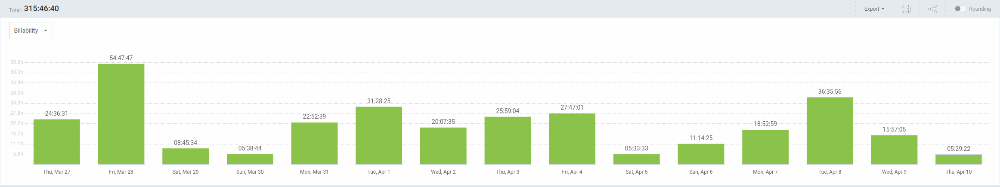

## Reporte de tiempo de Javier García Sebastián

**Periodo:** 02/05/2025 - 22/05/2025
**Total de tiempo trabajado:** 04:33:44

### Proyecto Pawtel - Distribución del tiempo

| Descripción                                                    | Duración   |
|----------------------------------------------------------------|------------|
| Creación posts instagram                                       | 01:12:19   |
| Imprimir y colocar carteles publicitarios                      | 00:34:00   |
| Grabación de la demo técnica del proyecto                      | 01:24:30   |
| Úlrimos informes sprint: IA y Horas                            | 00:30:55   |
| Clase / presentación del dia 16/05                             | 00:55:00   |

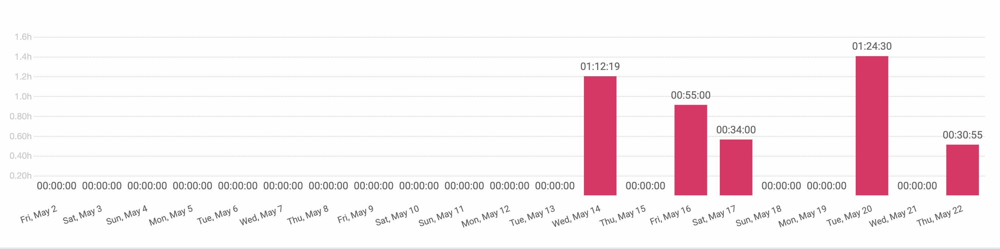

---

## Reporte de tiempo de Yesica Leydi Garate Fuentes

**Periodo:** 05/05/2025 - 22/05/2025
**Total de tiempo trabajado:** 16:20:00

### Proyecto Pawtel - Distribución del tiempo

| Descripción | Duración |
|-------------|---------|
| Desarrollo de Presentación - WPL FINAL (Video) | 05:00:00 |
| Desarrollo de Presentación - Evaluación de Rendimento individual | 00:20:00 |
| Gestión de RRSS - Programar publicaciones | 05:00:00 |
| Gestión de RRSS - Programar publicaciones| 06:00:00 |

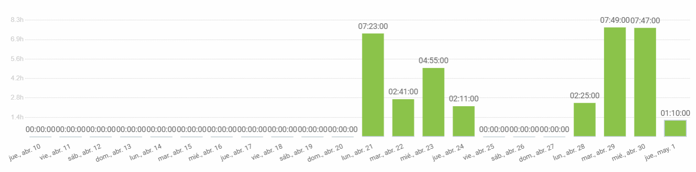
---

## Reporte de tiempo de Sergio Trenado Gonzalez

**Periodo:** 01/05/2025 - 22/05/2025
**Total de tiempo trabajado:** 07:26:55

### Proyecto Pawtel - Distribución del tiempo

| Descripción                                                                                                      | Duración  |
|------------------------------------------------------------------------------------------------------------------|-----------|
| PPL                                                                                                              | 03:30:00  |
| WPL Presentación + Reunión                                                                                       | 03:00:00  |
| Sesión de evaluación                                                                                             | 00:30:00  |
| Feedback presentación                                                                                            | 00:26:55  |

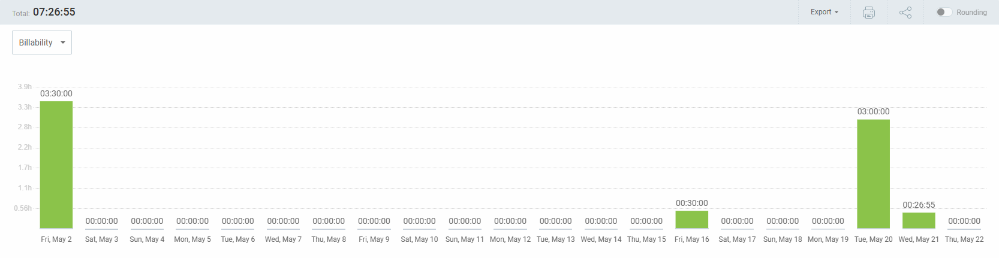
---

## Reporte de tiempo de Rafael Castillo Cebolla

**Periodo:** 10/04/2025 - 30/04/2025
**Total de tiempo trabajado:** 22:43:00

### Proyecto Pawtel - Distribución del tiempo

| Descripción | Duración |
|-------------|---------|
| QA | 05:50:00 |
| Arreglar error backen  | 06:36:00 |
| Pawtel points | 04:17:00  |
| Clases  | 06:00:00 |

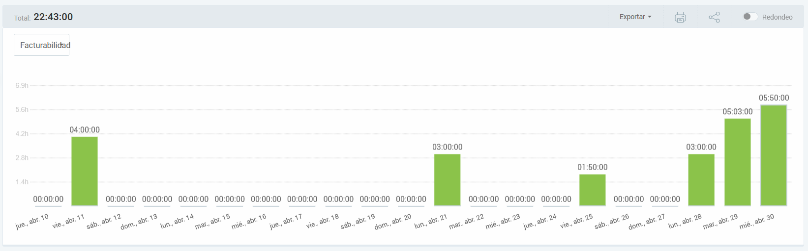
---

## Reporte de tiempo de Manuel Castillejo Vela

**Periodo:** 30/04/2025 - 22/05/2025

**Total de tiempo trabajado:** 09:09:34

### Proyecto Pawtel - Distribución del tiempo
| Description                                     | Time (h)   |
|-------------------------------------------------|------------|
| Informe de IA                                   | 00:21:24   |
| Presentacion individual                         | 00:22:12   |
| #291 Feature: Desarrollo Android                | 01:04:14   |
| KBReport                                        | 00:41:29   |
| Adicion de feedback a la base de datos comun    | 00:48:47   |
| Despliegue play store                           | 01:51:28   |
| Clase                                           | 04:00:00   |

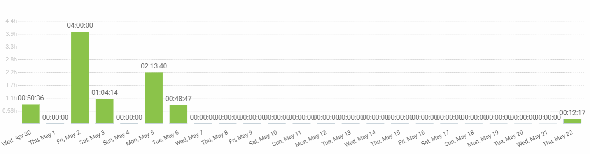
---

## Reporte de tiempo de Luis Mellado Diaz

**Periodo:** 02/05/2025 - 22/05/2025

**Total de tiempo trabajado:** 5:28:00

### Proyecto Pawtel - Distribución del tiempo

| Descripción                         | Duración  |
|-------------------------------------|-----------|
| Entrega WPL                         | 01:20:00  |
| Presentación WPL                    | 02:18:00  |
| Presentación de Desempeño           | 01:50:00  |

---

## Reporte de tiempo de Jorge Gomez de Tovar

**Periodo:** 02/05/2025 - 22/05/2025
**Total de tiempo trabajado:** 5:30:00

| Descripción                          | Duración  |
|--------------------------------------|-----------|
| Clase                                | 04:00:00  |
| Presentacion rendimiento             | 00:30:00  |
| Reunión WPL                          | 01:00:00  |

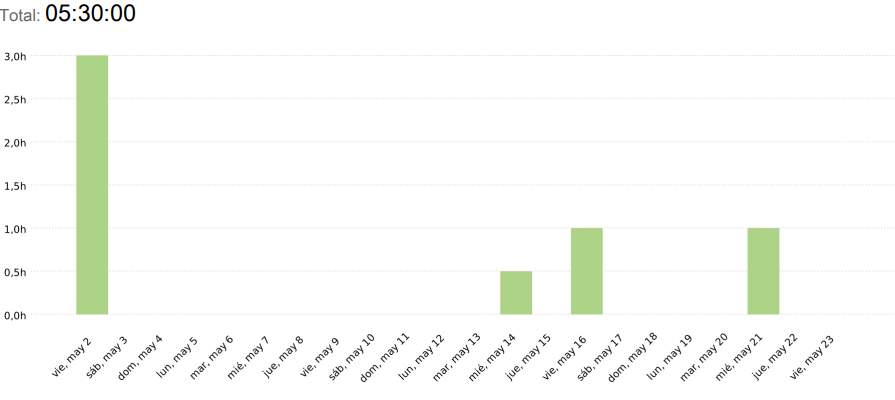
---

## Reporte de tiempo de Javier Ruiz Garrido

**Periodo:** 01/05/2025 - 22/05/2025
**Total de tiempo trabajado:** 08:21:13

### Proyecto Pawtel - Distribución del tiempo

| Descripción | Duración |
|-------------|---------|
| clase | 4:00:00 |
| slide evaluacion del desempeño | 00:21:08 |
| preparacion WPL | 04:00:05 |

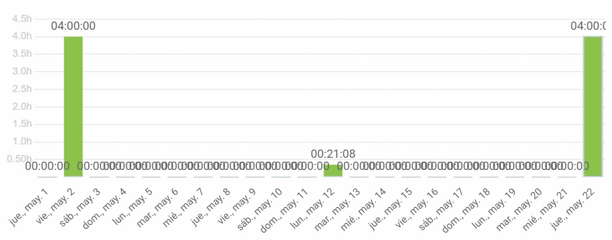
---

## Reporte de tiempo de Francisco Miguel Jiménez Morales

**Periodo:** 11/04/2025 - 02/05/2025
**Total de tiempo trabajado:** 20:28:09

### Proyecto Pawtel - Distribución del tiempo

| Descripción                                  | Duración   |
|----------------------------------------------|------------|
| Editar video demo técnica                    | 03:30:00   |

---

## Reporte de tiempo de Fernando Castelló Sanchez

**Periodo:** 30/04/2025 - 22/05/2025
**Total de tiempo trabajado:** 7:59:34

### Proyecto Pawtel - Distribución del tiempo

| Descripción | Duración |
|-------------|---------|
| Clase | 04:00:00 |
| Feedback | 00:15:48 |
| Presentación Individual | 00:27:33 |
| Presentación | 03:16:53 |

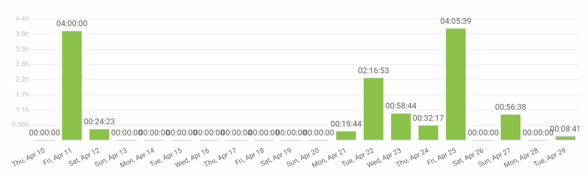
---

## Reporte de tiempo de David Gonzalez Martinez

**Periodo:** 30/04/2025 - 23/05/2025
**Total de tiempo trabajado:** 20:08:19

### Proyecto Pawtel - Distribución del tiempo

| Descripción                   | Duración  |
|-------------------------------|-----------|
| Pawtel                        | 20:08:19  |
| Android                       | 02:05:00  |
| Defensa                       | 00:30:00  |
| Deploy                        | 01:48:38  |
| Presentacion                  | 03:00:00  |
| Credenciales android          | 00:24:10  |
| Misc                          | 03:29:23  |
| Clases                        | 04:00:00  |
| Informe de tiempo e IA        | 00:14:33  |
| WPL                           | 04:00:00  |
| Release and deploy            | 00:36:35  |

---

## Reporte de tiempo de Daniel Flores de Francisco

**Periodo:** 11/04/2025 - 2/05/2025
**Total de tiempo trabajado:** 19:23:22

### Proyecto Pawtel - Distribución del tiempo

| Tarea                                      | Tiempo   |
|--------------------------------------------|----------|
| Reunion Marketing                          | 01:00:00 |
| Preparando PPL                             | 00:36:00 |
| Prsentacion PPL Semana 1.                  | 00:52:00 |
| Organización PPL y presentaciones          | 01:09:00 |
| ISPP                                       | 04:00:00 |
| Indexación de web por keyword              | 01:46:00 |
| Presentacion y delyvery PPL                | 02:00:00 |
| Clase ISPP                                 | 08:00:00 |
| Arreglar Test 1                            | 03:10:00 |
| SemRush Segmentacion Mercado               | 01:50:00 |
| Googlw Trends, Slides y QA                 | 04:00:00 |

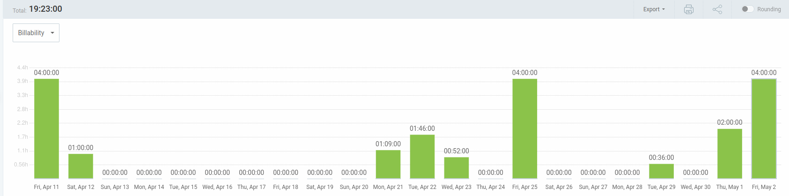
---

## Reporte de tiempo de Claudio Cortes Carrasco

**Periodo:** 02/05/2025 - 22/05/2025
**Total de tiempo trabajado:** 07:08:24

### Proyecto Pawtel - Distribución del tiempo

| Descripción | Duración |
|-------------|---------|
| Clases | 04:00:00 |
| Presentación individual | 00:25:00 |
| Presenrtación WPL | 02:43:24 |
|

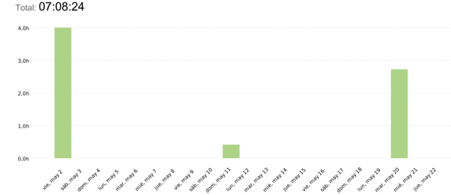
---

## Reporte de tiempo de Andrés Martínez Reviriego

**Periodo:** 30/04/2025 - 22/05/2025
**Total de tiempo trabajado:** 05:59:56

### Proyecto Pawtel - Distribución del tiempo

| Descripción | Duración |
|-------------|---------|
| Asistencia a clase | 04:00:00 |
| Presentación individual | 00:27:22 |
| Presentación WPL| 01:32:34 |

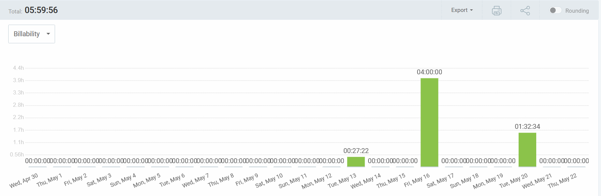
